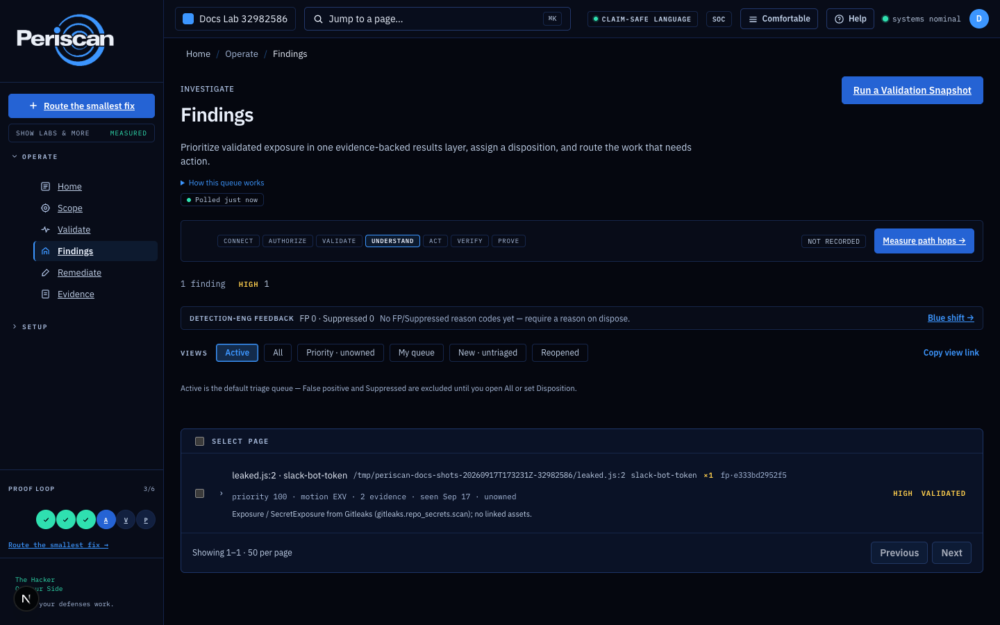
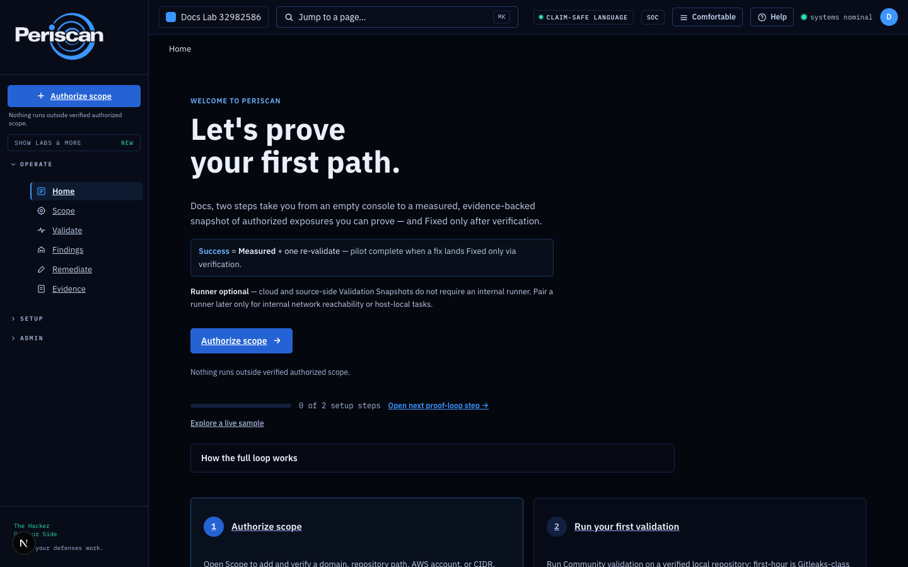
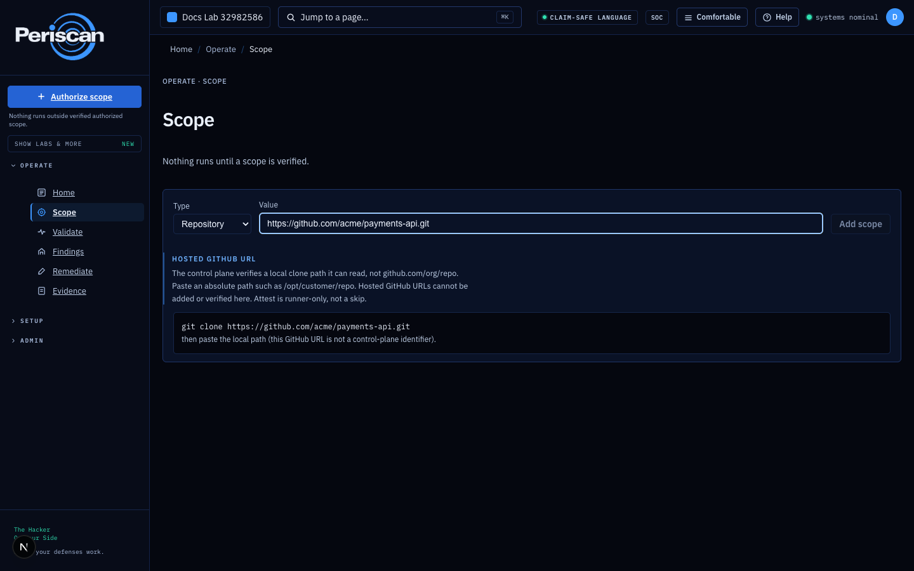
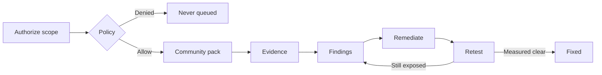

# Periscan

**Prove authorized exposures are real — and only mark them Fixed when a retest says so.**

**One job:** authorized local path → Gitleaks-class first hour → **Fixed after retest**.

Community edition is the Apache-2.0 **validation slice**: authorized local clone, policy, Gitleaks-class secrets (`jobsQueued=1`), evidence. **Fixed** only after a retest. Full BAS/AEV is the [development objective](docs/BAS_AEV_PROGRAM.md); this first-hour pack is the current shipped entry point. Not a Wiz / Tenable replacement. Not a live exploit library.

**For:** AppSec, platform, and security engineers who **own** the target, or are **contracted to test** it.

**Not for:** unauthorized scanning. BAS/AEV development includes Atomic, Caldera, SharpHound/BloodHound and Metasploit; live adapters require the qualification gates in [the program](docs/BAS_AEV_PROGRAM.md).

Need **Node 24** ([`.nvmrc`](.nvmrc)) and **Docker**. pnpm 9.15.0 via Corepack.

[Community](COMMUNITY.md) · [FAQ](FAQ.md) · [Using](USING.md) · [Setup](docs/SETUP.md) · [Security](SECURITY.md) · [Settled](docs/SETTLED.md)

<p align="center">
  <a href="LICENSE"></a>
  <a href="#verify"></a>
</p>

<p align="center">
  
</p>

<p align="center"><em>First-hour story: authorize a local clone → Gitleaks-class secrets finding with evidence → remediate → retest. <strong>Fixed</strong> only after the retest clears it.</em></p>

## Start

Clone this repo, inspect it, then install. **Node 24** and **Docker** first.

```bash
git clone https://github.com/seanventures/periscan.git
cd periscan
bash scripts/periscan.sh install
bash scripts/periscan.sh start
```

Then in the UI — one job:

1. **Authorize a local clone path** — `git clone <your-repo>` on the machine running Periscan, then paste the **absolute path**. A hosted `github.com/org/repo` URL is not a control-plane path. (The UI refuses the URL and shows the clone command — paste the path after clone.)
2. **Run Community validation** — first hour is **Gitleaks-class secrets** (`jobsQueued=1`). Not the full pack. Not the engine mall below.
3. Open remediations from **that** mission. They stay **Open** until a retest produces a verification event. Creating a ticket is not Fixed.

<p align="center">
  
</p>
<p align="center">
  
</p>

Secondary one-paste (inspect `install.sh` first):

```bash
curl -fsSL --proto '=https' --tlsv1.2 https://raw.githubusercontent.com/seanventures/periscan/main/install.sh | bash
```

Safer: download, inspect, then `bash install.sh`. `bash install.sh --dry-run` prints the plan. Pipe help: `bash -s -- --help`.

Repair:

```bash
bash install.sh doctor    # health + repair
bash install.sh health    # check only
bash install.sh --dry-run
```

Local/self-host: [docs/SETUP.md](docs/SETUP.md). Operator notes: [USING.md](USING.md). Full FAQ: [docs/FAQ.md](docs/FAQ.md). Offering: [COMMUNITY.md](COMMUNITY.md).

Measurement mark lives in [docs/BADGES.md](docs/BADGES.md). This repo has no dogfood Community evidence yet — do not treat the product as measured.

## Contents

- [Start](#start)
- [Docs](#docs)
- [Proof loop](#proof-loop)
- [Safety floor](#safety-floor)
- [Compared to](#compared-to-what-you-already-run)
- [Community pack](#community-pack)
- [Contributing](#contributing)
- [License](#license)

---

## Proof loop



| Scope                   | How you prove authorization                                                        |
| ----------------------- | ---------------------------------------------------------------------------------- |
| Domain / subdomain      | DNS TXT                                                                            |
| Repository              | `.periscan-authorization` token file (or Owner/Admin attestation when runner-only) |
| Cloud account           | Connected AWS account match, or Owner/Admin attestation                            |
| IP range / internal net | Audited Owner/Admin attestation                                                    |

Denied work **never queues**. No evidence for that mission → **empty list**, not theater. **Fixed** requires a verification event; ticket close is `ClosedWithoutEvidence`.

---

## Safety floor

This is the product, not a missing checkbox.

| Guarantee                | Meaning                                                                            |
| ------------------------ | ---------------------------------------------------------------------------------- |
| Authorized scope only    | No third-party scanning without verified authorization                             |
| Denied never queued      | Policy `Denied` fails closed before the job queue                                  |
| Non-destructive          | No exfil, persistence, credential theft, or uncontrolled exploit chaining          |
| Live offensive packs off | Unqualified adapters stay off until implementation, policy, cleanup and evidence gates pass   |
| Runner is outbound       | HTTPS signed-task polling. No inbound management plane as the default              |
| Fixed is earned          | Status `Fixed` only after a measured retest                                        |
| Path words are earned    | `validated` / `measured` / `reachable` / `exploitable` follow weakest-hop evidence |
| Scanners stay backstage  | Tool JSON is evidence, not the UX or the report                                    |

[SECURITY_BOUNDARIES.md](SECURITY_BOUNDARIES.md) · [SECURITY.md](SECURITY.md) · [docs/SETTLED.md](docs/SETTLED.md)

---

## Compared to what you already run

**Community first hour** is Gitleaks-class secrets (`jobsQueued=1`) on an authorized local clone. The broader program is BAS/AEV plus authorized validation — not an ASV/CTEM platform in a box, and not a live exploit library.

|                                | CLI scanners       | Aggregators (DefectDojo) | CNAPP / RBVM         | BAS / auto-pentest | **Periscan**                              |
| ------------------------------ | ------------------ | ------------------------ | -------------------- | ------------------ | ----------------------------------------- |
| Job                            | Find issues        | Dedup imports            | Inventory / vuln SoR | Attack libraries   | **Prove** exposure and **re-prove** fixes |
| Starts without verified scope? | Usually            | N/A                      | Connectors           | Often              | **No**                                    |
| Policy deny never queues?      | Exit codes         | N/A                      | Tickets              | Varies             | **Product guarantee**                     |
| `Fixed`                        | Re-run the tool    | Ticket workflow          | SLA / close          | Sometimes retest   | **Only after verification**               |
| Live ransomware / kill-chain   | Unrelated          | Unrelated                | Unrelated            | Often the demo     | **Hard no**                               |
| Replace Wiz / Tenable?         | No                 | No                       | They _are_ those     | No                 | **No — co-exist**                         |
| Product LICENSE                | Usually Apache/MIT | BSD (DefectDojo OS)      | Proprietary          | Proprietary        | **Apache-2.0 + upstream engine SPDX**     |

Nuclei is a first-class **engine** (second mission, allowlisted safe profiles). Periscan is not a Nuclei wrapper and does not compete on template count.

---

## Community pack

Self-hosted **validation slice**: verified scope + policy + permissive SPDX engines + first-party checks + evidence. Load binaries in **Engine Lab → Install + enable Community pack**.

First hour on a verified repo is **Gitleaks-class secrets** (`jobsQueued=1`). The table below is the **installable catalog** — a second control, not the start button. BAS adapters (Atomic / Caldera / SharpHound / Metasploit) need qualification; this is not a live exploit library.

Not live Atomic / Caldera / Metasploit / sqlmap. Source is **Apache-2.0**; third-party engines keep their own SPDX.

| Pack                      | Installable catalog (not first-hour default)                                                                            |
| ------------------------- | ----------------------------------------------------------------------------------------------------------------------- |
| Secrets                   | Gitleaks, detect-secrets, git-secrets, secretlint, Talisman, Whispers                                                   |
| SCA                       | Trivy, OSV-Scanner, Grype, pip-audit, govulncheck, cargo-audit, retire.js, Nancy, Dependency-Check                      |
| SAST                      | Bandit, gosec, Brakeman, Horusec, Sobelow                                                                               |
| IaC                       | Checkov, Terrascan, KICS, kube-linter, kube-score, Kubescape, Conftest, tfsec, cfn-nag, Polaris, kubeaudit, Trivy misconfig |
| SBOM / provenance         | Syft, cdxgen, slsa-verifier                                                                                             |
| Containers / Kubernetes   | Dockle, Trivy, kube-bench, Popeye                                                                                       |
| TLS / HTTP                | SSLyze, tlsx, first-party DNS / headers / cookies / CORS                                                                |
| Web                       | ZAP baseline, Katana; Nuclei safe exposure (**second mission**)                                                         |
| Cloud                     | Prowler on **Connected** AWS, cloudlist                                                                                 |
| Recon _(runner enrolled)_ | nmap, naabu, Amass _passive_, Subfinder, httpx, dnsx                                                                    |
| Detection _content_       | YARA repo rules, Falco **rules lint** (not Falco-as-runtime)                                                            |

GPL / LGPL (Semgrep, testssl, Nikto, …) stay **Engine Lab + license accept**. Atomic / Caldera / SharpHound / Metasploit are BAS development targets; current unqualified adapters remain excluded from Community start. sqlmap remains unavailable for live validation.

Missing binaries are `tool_unavailable` / Inconclusive — not invented findings.

---

## Contributing

Apache-2.0 with an open-source **engine-adapter** surface. Read [CONTRIBUTING.md](CONTRIBUTING.md), [docs/ADAPTER_FIRST_PR.md](docs/ADAPTER_FIRST_PR.md), and [GOVERNANCE.md](GOVERNANCE.md).

File issues on **[seanventures/periscan](https://github.com/seanventures/periscan/issues)** (bug, feature, [engine-adapter](https://github.com/seanventures/periscan/issues/new?template=engine-adapter.yml)).

| Rung                  | What to send                                                                        | Done looks like                                                       |
| --------------------- | ----------------------------------------------------------------------------------- | --------------------------------------------------------------------- |
| 0. Hygiene            | Typo, claim-language nit                                                            | Matches the [claim deny-list](packages/shared/src/claim-deny-list.ts) |
| 1. First useful PR    | Module **adapter + fixture** for a permissive engine (cfn-lint, tflint, parliament) | `pnpm --filter @periscan/modules test`, `pnpm licenses:check`         |
| 2. Pack honesty       | License row, Engine Lab metadata, notices                                           | `pnpm licenses:write` then `pnpm licenses:check`                      |
| 3. Policy / Fixed     | Denied never queues, or Fixed cannot flip without verify                            | Hits policy / `fix-verification` tests                                |
| 4. Intake (no binary) | `POST /api/v1/third-party-tools/intake/validate`                                    | Certification report; not an unreviewed runtime                       |
| 5. Change control | Prisma wholesale, runner transport, **LICENSE** | Existing approval rules apply. BAS development follows the authorized program and adapter release gates. |

Build and qualify BAS/AEV adapters under the authorized program. Preserve auth,
outbound signed-task transport and evidence-focused UX. Customer execution
requires a qualified scenario and its scope-bound policy decision.

### Verify

```bash
pnpm verify
```

That is the release gate. Before a PR: `pnpm lint && pnpm typecheck && pnpm test && pnpm licenses:check`.

---

## License

Root [`LICENSE`](./LICENSE) is **Apache-2.0**. Community edition is the open-core **validation slice**, not a second product license. Full BAS/AEV expansion follows the [program](docs/BAS_AEV_PROGRAM.md). Hosted SaaS / MSSP / marketplace stay commercial product. Third-party engines keep their SPDX — [licenses/THIRD_PARTY_NOTICES.md](licenses/THIRD_PARTY_NOTICES.md). The private product tree stays private.

[OPEN_CORE.md](OPEN_CORE.md) · [NOTICE](./NOTICE)

---

## Docs

| Doc | What it covers |
| --- | --- |
| [SETUP](docs/SETUP.md) | Prerequisites, install, first-hour local path, Fixed-via-verify |
| [FAQ](FAQ.md) | Short claim-safe answers |
| [USING](USING.md) | Ports, HTTP proof loop, lab hops |
| [SECURITY](SECURITY.md) | Vulnerability intake (title-only `[SECURITY]`, no PoC) |
| [COMMUNITY](COMMUNITY.md) | What Community edition is / is not |
| [OPEN_CORE](OPEN_CORE.md) | Apache-2.0 slice vs commercial surface |
| [docs/ENTERPRISE.md](docs/ENTERPRISE.md) | CISO / admin: Community vs commercial |
| [docs/SOC2.md](docs/SOC2.md) | Vendor Type II not claimed; customer support pack |
| [docs/SETTLED.md](docs/SETTLED.md) | Settled axioms |
| [ARCHITECTURE.md](ARCHITECTURE.md) | System shape |
| [CODE_OF_CONDUCT.md](CODE_OF_CONDUCT.md) | Conduct |

## More

See [Docs](#docs). [docs/FAQ.md](docs/FAQ.md) · [docs/USING.md](docs/USING.md)

Maintainer: GitHub has no API for the social preview image — upload [`docs/images/github-social-preview.png`](docs/images/github-social-preview.png) (1280×640) at **Settings → Social preview**.
