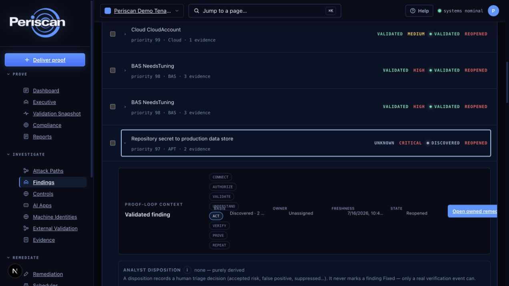
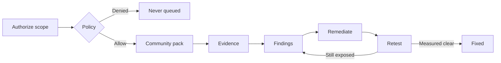

# Periscan

**Prove authorized exposures are real — and only mark them Fixed when a retest says so.**

Community edition is the Apache-2.0 **validation slice**: authorized local clone, policy, Gitleaks-class secrets (`jobsQueued=1`), evidence. **Fixed** only after a retest. Not full BAS. Not a Wiz / Tenable replacement.

**For:** AppSec, platform, and security engineers who **own** the target, or are **contracted to test** it.

**Not for:** unauthorized scanning. **Not** a Nuclei wrapper, Wiz/Tenable replacement, full BAS, or live Atomic / Caldera / Metasploit.

Need **Node 24** ([`.nvmrc`](.nvmrc)) and **Docker**. pnpm 9.15.0 via Corepack.

[Community](COMMUNITY.md) · [FAQ](FAQ.md) · [Using](USING.md) · [Security](SECURITY.md) · [Settled](docs/SETTLED.md)

<p align="center">
  <a href="LICENSE"></a>
  <a href="#verify"></a>
</p>

<p align="center">
  
</p>

<p align="center"><em>First-hour story: authorize a local clone → Gitleaks-class secrets finding with evidence → remediate → retest. <strong>Fixed</strong> only after the retest clears it.</em></p>

## Start

Clone this repo, inspect it, then install. **Node 24** and **Docker** first.

```bash
git clone https://github.com/seanventures/periscan.git
cd periscan
bash scripts/periscan.sh install
bash scripts/periscan.sh start
```

Then in the UI:

1. **Authorize a local clone path** — `git clone <your-repo>` on the machine running Periscan, then paste the **absolute path**. A hosted `github.com/org/repo` URL is not a control-plane path.
2. **Run Community validation** — first hour is **Gitleaks-class secrets** (`jobsQueued=1`). Not the full pack.
3. Open remediations from **that** mission. They stay **Open** until a retest produces a verification event. Creating a ticket is not Fixed.

Secondary one-paste (inspect `install.sh` first):

```bash
curl -fsSL --proto '=https' --tlsv1.2 https://raw.githubusercontent.com/seanventures/periscan/main/install.sh | bash
```

Safer: download, inspect, then `bash install.sh`. `bash install.sh --dry-run` prints the plan. Pipe help: `bash -s -- --help`.

Repair:

```bash
bash install.sh doctor    # health + repair
bash install.sh health    # check only
bash install.sh --dry-run
```

Details: [USING.md](USING.md). Full FAQ: [docs/FAQ.md](docs/FAQ.md). Offering: [COMMUNITY.md](COMMUNITY.md).

---

<p align="center">
  
</p>

This repo has no dogfood Community evidence yet, so the mark is **not-measured**. Swap to [`docs/images/badge-measured.svg`](docs/images/badge-measured.svg) only after an authorized Community run produces evidence. Never recolor it Fixed-green without a verification event. See [docs/BADGES.md](docs/BADGES.md).

## Contents

- [Start](#start)
- [Proof loop](#proof-loop)
- [Safety floor](#safety-floor)
- [Compared to](#compared-to-what-you-already-run)
- [Community pack](#community-pack)
- [Contributing](#contributing)
- [License](#license)

---

## Proof loop



| Scope                   | How you prove authorization                                                        |
| ----------------------- | ---------------------------------------------------------------------------------- |
| Domain / subdomain      | DNS TXT                                                                            |
| Repository              | `.periscan-authorization` token file (or Owner/Admin attestation when runner-only) |
| Cloud account           | Connected AWS account match, or Owner/Admin attestation                            |
| IP range / internal net | Audited Owner/Admin attestation                                                    |

Denied work **never queues**. No evidence for that mission → **empty list**, not theater. **Fixed** requires a verification event; ticket close is `ClosedWithoutEvidence`.

---

## Safety floor

This is the product, not a missing checkbox.

| Guarantee                | Meaning                                                                            |
| ------------------------ | ---------------------------------------------------------------------------------- |
| Authorized scope only    | No third-party scanning without verified authorization                             |
| Denied never queued      | Policy `Denied` fails closed before the job queue                                  |
| Non-destructive          | No exfil, persistence, credential theft, or uncontrolled exploit chaining          |
| Live offensive packs off | Atomic, Caldera, SharpHound, ransomware, Metasploit stay off without a legal SOW   |
| Runner is outbound       | HTTPS signed-task polling. No inbound management plane as the default              |
| Fixed is earned          | Status `Fixed` only after a measured retest                                        |
| Path words are earned    | `validated` / `measured` / `reachable` / `exploitable` follow weakest-hop evidence |
| Scanners stay backstage  | Tool JSON is evidence, not the UX or the report                                    |

[SECURITY_BOUNDARIES.md](SECURITY_BOUNDARIES.md) · [SECURITY.md](SECURITY.md) · [docs/SETTLED.md](docs/SETTLED.md)

---

## Compared to what you already run

Periscan is a self-service Automated Security Validation platform.
Find the path. Validate the risk. Prove it's fixed.
Periscan validates exposure, controls, attack paths, AI applications, and fixes, then turns the results into proof you can use. Community first hour is not that whole tree — it is Gitleaks-class secrets (`jobsQueued=1`) on an authorized local clone.

|                                | CLI scanners       | Aggregators (DefectDojo) | CNAPP / RBVM         | BAS / auto-pentest | **Periscan**                              |
| ------------------------------ | ------------------ | ------------------------ | -------------------- | ------------------ | ----------------------------------------- |
| Job                            | Find issues        | Dedup imports            | Inventory / vuln SoR | Attack libraries   | **Prove** exposure and **re-prove** fixes |
| Starts without verified scope? | Usually            | N/A                      | Connectors           | Often              | **No**                                    |
| Policy deny never queues?      | Exit codes         | N/A                      | Tickets              | Varies             | **Product guarantee**                     |
| `Fixed`                        | Re-run the tool    | Ticket workflow          | SLA / close          | Sometimes retest   | **Only after verification**               |
| Live ransomware / kill-chain   | Unrelated          | Unrelated                | Unrelated            | Often the demo     | **Hard no**                               |
| Replace Wiz / Tenable?         | No                 | No                       | They _are_ those     | No                 | **No — co-exist**                         |
| Product LICENSE                | Usually Apache/MIT | BSD (DefectDojo OS)      | Proprietary          | Proprietary        | **Apache-2.0 + upstream engine SPDX**     |

Nuclei is a first-class **engine** (second mission, allowlisted safe profiles). Periscan is not a Nuclei wrapper and does not compete on template count.

---

## Community pack

Self-hosted **validation slice**: verified scope + policy + permissive SPDX engines + first-party checks + evidence. Load binaries in **Engine Lab → Install + enable Community pack**.

First hour on a verified repo is **Gitleaks-class secrets** (`jobsQueued=1`). The table below is the **installable catalog** — a second control, not the start button.

Not live Atomic / Caldera / Metasploit / sqlmap. Source is **Apache-2.0**; third-party engines keep their own SPDX.

| Pack                      | Installable catalog (not first-hour default)                                                                            |
| ------------------------- | ----------------------------------------------------------------------------------------------------------------------- |
| Secrets                   | Gitleaks, detect-secrets, git-secrets, secretlint, Talisman, Whispers                                                   |
| SCA                       | Trivy, OSV-Scanner, Grype, pip-audit, govulncheck, cargo-audit, retire.js, Nancy, Dependency-Check                      |
| SAST                      | Bandit, gosec, Brakeman, Horusec, Sobelow                                                                               |
| IaC                       | Checkov, Terrascan, KICS, kube-linter, kube-score, Kubescape, Conftest, tfsec, cfn-nag, Polaris, kubeaudit, Trivy misconfig |
| SBOM / provenance         | Syft, cdxgen, slsa-verifier                                                                                             |
| Containers / Kubernetes   | Dockle, Trivy, kube-bench, Popeye                                                                                       |
| TLS / HTTP                | SSLyze, tlsx, first-party DNS / headers / cookies / CORS                                                                |
| Web                       | ZAP baseline, Katana; Nuclei safe exposure (**second mission**)                                                         |
| Cloud                     | Prowler on **Connected** AWS, cloudlist                                                                                 |
| Recon _(runner enrolled)_ | nmap, naabu, Amass _passive_, Subfinder, httpx, dnsx                                                                    |
| Detection _content_       | YARA repo rules, Falco **rules lint** (not Falco-as-runtime)                                                            |

GPL / LGPL (Semgrep, testssl, Nikto, …) stay **Engine Lab + license accept**. Atomic / Caldera / SharpHound / sqlmap / Metasploit stay catalog theater — never Community start.

Missing binaries are `tool_unavailable` / Inconclusive — not invented findings.

---

## Contributing

Apache-2.0 with an open-source **engine-adapter** surface. Read [CONTRIBUTING.md](CONTRIBUTING.md), [docs/ADAPTER_FIRST_PR.md](docs/ADAPTER_FIRST_PR.md), and [GOVERNANCE.md](GOVERNANCE.md).

File issues on **[seanventures/periscan](https://github.com/seanventures/periscan/issues)** (bug, feature, [engine-adapter](https://github.com/seanventures/periscan/issues/new?template=engine-adapter.yml)).

| Rung                  | What to send                                                                        | Done looks like                                                       |
| --------------------- | ----------------------------------------------------------------------------------- | --------------------------------------------------------------------- |
| 0. Hygiene            | Typo, claim-language nit                                                            | Matches the [claim deny-list](packages/shared/src/claim-deny-list.ts) |
| 1. First useful PR    | Module **adapter + fixture** for a permissive engine (cfn-lint, tflint, parliament) | `pnpm --filter @periscan/modules test`, `pnpm licenses:check`         |
| 2. Pack honesty       | License row, Engine Lab metadata, notices                                           | `pnpm licenses:write` then `pnpm licenses:check`                      |
| 3. Policy / Fixed     | Denied never queues, or Fixed cannot flip without verify                            | Hits policy / `fix-verification` tests                                |
| 4. Intake (no binary) | `POST /api/v1/third-party-tools/intake/validate`                                    | Certification report; not an unreviewed runtime                       |
| 5. Ask first          | Live Atomic/Caldera/SharpHound, Prisma wholesale, runner transport, **LICENSE**     | Closed. Founder + counsel + legal SOW                                 |

Do not enable live offensive packs, rewrite auth, open inbound runner ports, or put raw scanner output in the primary UI.

### Verify

```bash
pnpm verify
```

That is the release gate. Before a PR: `pnpm lint && pnpm typecheck && pnpm test && pnpm licenses:check`.

---

## License

Root [`LICENSE`](./LICENSE) is **Apache-2.0**. Community edition is the open-core **validation slice**, not a second product license and not full BAS. Hosted SaaS / MSSP / marketplace stay commercial product. Third-party engines keep their SPDX — [licenses/THIRD_PARTY_NOTICES.md](licenses/THIRD_PARTY_NOTICES.md). The private product tree stays private.

[OPEN_CORE.md](OPEN_CORE.md) · [NOTICE](./NOTICE)

---

## More

[FAQ.md](FAQ.md) · [USING.md](USING.md) · [docs/FAQ.md](docs/FAQ.md) · [docs/USING.md](docs/USING.md) · [COMMUNITY.md](COMMUNITY.md) · [ARCHITECTURE.md](ARCHITECTURE.md) · [SECURITY.md](SECURITY.md) · [docs/SETTLED.md](docs/SETTLED.md) · [CODE_OF_CONDUCT.md](CODE_OF_CONDUCT.md)
