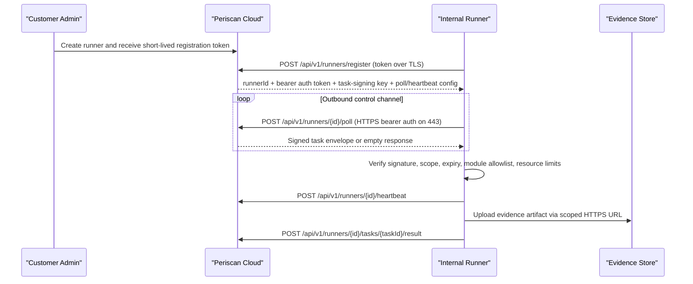

# Periscan Runner Architecture

> This document holds the transport rationale. The full functional specification
> (lifecycle, runner/task states, field tables, API surface, kill switch, module
> allowlist, communication modes) lives in [docs/RUNNER_SPEC.md](docs/RUNNER_SPEC.md).
> Founder decision GAP-OSS-AGENT-01: outbound-only signed-task transport, **no reverse
> SSH / arbitrary shell / tunnel** in MVP; a restricted task-tunnel is docs-only/future.
>
> **Supported Customer Runner packaging:** Go `apps/runner` is production LTS;
> TypeScript `apps/runner-agent` is AgentLocal companion capability — not a second
> enterprise package. See [docs/SUPPORTED_CUSTOMER_RUNNER.md](docs/SUPPORTED_CUSTOMER_RUNNER.md).

The Periscan internal runner is the customer-network execution point for internal reachability checks, control validation support, and other policy-approved modules that must run close to customer assets.

## Decision summary

- Primary transport: outbound HTTPS long-poll on `443`
- Authentication: mutual TLS with a short-lived client certificate issued at registration time
- Task authorization: every task also carries a signed envelope with `tenantId`, `runnerId`, `scopeId`, `moduleId`, `expiry`, and `nonce`
- Evidence return path: outbound HTTPS upload or callback to Periscan Cloud
- Firewall model: no inbound rules, no NAT traversal, no port forwarding, no reverse SSH tunnel in the default design
- Streaming later: WebSocket over HTTPS can be added later for logs or interactive control, but it is not required for the baseline runner

## Why not reverse SSH

Reverse SSH is not the default Periscan transport.

Reasons:

- It creates a long-lived tunnel that is harder to reason about, audit, and rotate than normal outbound HTTPS.
- It couples cloud availability, session lifetime, and internal network reachability too tightly.
- It complicates enterprise proxy support and can be killed by firewall idle timeouts.
- It introduces a broader remote-access mental model than Periscan needs for scoped validation tasks.
- It is harder to present as a narrowly bounded product control to customers and security reviewers.

Periscan should behave like a tightly scoped outbound worker, not like a general remote shell.

## Primary communication model

## Registration flow

1. A tenant admin creates a runner in Periscan Cloud.
2. Periscan issues a short-lived registration token.
3. The runner calls `POST /api/v1/runners/register` with:
   - registration token
   - runner version
   - hostname
   - deployment mode
   - capabilities
   - network profile
4. Periscan validates the token and issues:
   - `runnerId`
   - bearer auth token
   - tenant ID
   - task-signing key ID + public key
   - control-plane URL
   - heartbeat interval
   - poll interval
   - chosen control channel

## Credential rotation flow

The runner can rotate issued credential metadata without re-registering:

1. The runner calls `POST /api/v1/runners/{id}/credentials/rotate` with its existing runner auth token and matching tenant/runner identity.
2. Periscan refreshes credential expiry metadata, task-signing key references, and version, then writes a `runner.credentials.rotated` audit event.
3. Periscan does not return a new runner auth token during rotation.

If the tenant or runner identity does not match the authenticated runner, Periscan rejects the request and writes a runner rejection audit event.

## Control channel

Baseline API change from the earlier rough PRD:

- Prefer `POST /api/v1/runners/{id}/poll` over `GET /runners/:id/tasks`

Why:

- long-poll requests can carry acknowledgements, last-seen cursor, and lightweight health metadata
- easier proxy behavior than trying to overload `GET`
- cleaner future support for backoff hints and task batching

Control-channel properties:

- outbound only
- HTTPS on `443`
- bearer token authentication required
- short polling or long polling depending on server response
- standard load balancer compatible
- proxy compatible via HTTP CONNECT

## Task envelope security

Every task is protected by two layers:

1. Transport authentication: the runner authenticates to Periscan Cloud with a bearer
   token over TLS.
2. Task envelope signature: the task itself is signed by Periscan Cloud with a
   per-tenant persisted Ed25519 key.

The runner must reject a task if any of these checks fail:

- `runnerId` mismatch
- `tenantId` mismatch
- expired `expiresAt`
- reused `nonce`
- invalid signature
- `executionEnvironment != InternalRunner`
- scope target outside approved constraints
- module not allowlisted locally
- requested resource usage exceeds local policy

## Scope and local enforcement

Periscan Cloud policy is necessary but not sufficient. The runner also enforces the task locally.

Every task must include local scope constraints such as:

- approved CIDRs
- approved hostnames
- approved DNS suffixes
- approved ports
- forbid-internet-egress flag where applicable

If the task target falls outside the local scope envelope, the runner denies execution and returns an auditable rejection result.

## Firewall and proxy expectations

Required egress:

- DNS resolution for Periscan Cloud runner gateway hostnames
- outbound TCP `443` to the Periscan runner gateway

Optional but supported:

- outbound HTTPS through a customer HTTP CONNECT proxy
- proxy authentication if the runner is configured explicitly

Not required:

- inbound firewall rules
- customer-side load balancer
- customer-side public IP
- reverse port forward
- SSH bastion

## Evidence and result return

The runner should not keep long-term evidence storage locally.

Recommended pattern:

- small results: `POST /api/v1/runners/{id}/tasks/{taskId}/result`
- larger artifacts: pre-scoped HTTPS upload URL issued in the task envelope

Every result should include:

- task identifiers
- local audit hash
- normalized outcome summary
- validation state
- evidence manifest with uploaded evidence IDs when the artifact upload path is used
- error summary if applicable

## Failure and revocation model

The runner must support:

- certificate expiry handling and rotation
- cloud-side revocation
- local kill switch
- exponential backoff on control-plane failures
- empty poll responses without erroring
- network partition tolerance without unsafe fallback behavior

If Periscan revokes a runner:

- future mTLS sessions must fail
- outstanding tasks must not continue after lease expiry
- the runner should surface `Revoked` locally and stop polling

## Implementation sequence

1. Shared schemas for registration, heartbeat, task envelopes, and results
2. API runner registry and registration endpoints
3. Signed task envelopes, artifact upload URL, and runner poll endpoint
4. Go runner mTLS bootstrap, credential rotation, artifact upload, and heartbeat loop
5. First internal module: safe reachability check
6. Optional WebSocket streaming for logs later

## Current repo contract

The initial shared runner transport schemas live in:

- [packages/shared/src/runner.ts](/Volumes/DataSSD1/test/periscan/packages/shared/src/runner.ts)

That file is the source of truth for:

- registration payloads
- issued credentials
- credential rotation
- artifact upload requests
- heartbeat payloads
- task envelopes
- result payloads
- transport decisions
