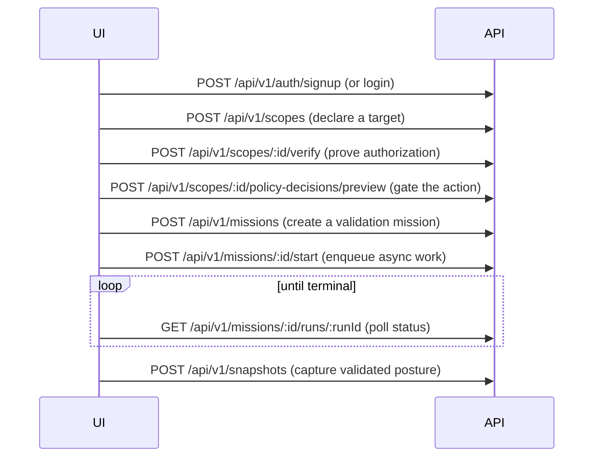

# Periscan API Integration Guide (for UI and automation teams)

This document is the single reference a separate frontend or automation team needs to integrate with Periscan without reading the service implementation. The API at `/api/v1/*` is the source of truth for every product capability; the bundled web app is only a reference consumer.

The machine-readable contract is always available at runtime:

- `GET /openapi.json` — the OpenAPI document.
- `GET /api/v1/api-reference` — a grouped, human-friendly endpoint index
  derived from the OpenAPI document, including the authentication mode and
  query-parameter names plus request/response schema availability, content
  types, and success statuses for each route.
  Groups use product namespaces such as Validation, Threat Center, Model
  Gateway, Operators, Jobs, Approvals, Policy, Audit, MITRE ATT&CK, and
  Deployment so customers do not need to infer workflow ownership from paths.

## Replacing the bundled UI

The current Next.js app is a replaceable reference consumer. A fresh product
surface should integrate against the API, not the React component tree or
package internals.

Use this contract when building a new UI:

| Product area | API namespace |
| ------------ | ------------- |
| Auth, sessions, API keys, tenants, SSO | `/api/v1/auth/*`, `/api/v1/me`, `/api/v1/tenants/current/*` |
| Scope authorization and policy previews | `/api/v1/scopes/*`, `/api/v1/*/policy-decisions/preview` |
| Integrations and signal collection | `/api/v1/integrations/*`, `/api/v1/signals/*` |
| Modules, OSS tools, and tool governance | `/api/v1/modules`, `/api/v1/open-source-tools`, `/api/v1/open-source-capabilities`, `/api/v1/third-party-tools/*` |
| Missions, jobs, Snapshot, schedules, CTEM | `/api/v1/missions/*`, `/api/v1/jobs/*`, `/api/v1/snapshots/*`, `/api/v1/schedules/*`, `/api/v1/ctem/*` |
| Evidence, reports, findings, attack paths | `/api/v1/evidence/*`, `/api/v1/reports/*`, `/api/v1/findings/*`, `/api/v1/attack-paths/*` |
| Remediation and fix verification | `/api/v1/remediations/*`, `/api/v1/verification-events/*` |
| AI apps, controls, operators, model gateway | `/api/v1/ai-apps/*`, `/api/v1/control-sources/*`, `/api/v1/operators/*`, `/api/v1/model-gateway/*` |
| Threat Center | `/api/v1/threat-advisories/*`, `/api/v1/threat-intel/*`, `/api/v1/threat-feeds/*` |
| Internal runners | `/api/v1/runners/*` |
| Billing, audit, trust, deployment, webhooks | `/api/v1/billing/*`, `/api/v1/audit-events/*`, `/api/v1/system/*`, `/api/v1/tenants/current/webhooks/*` |

Replacement UIs should use `/api/v1/api-reference` to discover route groups and
request/response schema availability, then use `/openapi.json` for generated
clients and automated contract tests. Do not infer capabilities from the
bundled UI; if a capability lacks an API route, treat it as not implemented.

Third-party tools are intentionally split between catalog visibility and
execution eligibility. Catalog-only or fixture-only capabilities can appear in
`/api/v1/open-source-tools` and `/api/v1/open-source-capabilities`, but they
must not be queued through missions unless `/api/v1/modules` exposes a matching
module and policy/tenant governance marks the tool executable.

## Authentication

Periscan accepts two credential types on the same routes.

### Session cookies (browser users)

Email/password sign-in establishes an HttpOnly session cookie named `periscan_session`.

- `POST /api/v1/auth/signup` — create the first user and tenant; returns the session cookie and the authenticated payload.
- `POST /api/v1/auth/login` — exchange credentials for a session cookie.
- `POST /api/v1/auth/logout` — clear the session.

Cookies are marked `Secure` automatically in production (`PERISCAN_DEPLOYMENT_ENVIRONMENT=production`) and can be forced on elsewhere with `PERISCAN_COOKIE_SECURE=true`. If a browser UI is served from a different origin than the API, set `PERISCAN_CORS_ORIGINS` to a comma-separated allow-list so credentialed cross-origin requests succeed.

### Tenant API keys (servers and automation)

A tenant API key is the recommended credential for an external UI's server-side calls and for CI/integration automation. Pass it as a bearer token:

```
Authorization: Bearer psk_<secret>
```

Keys are managed by tenant admins:

| Method | Path                                                | Purpose                                                      |
| ------ | --------------------------------------------------- | ------------------------------------------------------------ |
| POST   | `/api/v1/tenants/current/api-keys`                  | Create a key (the secret is returned exactly once)           |
| GET    | `/api/v1/tenants/current/api-keys`                  | List keys (never returns secrets)                            |
| DELETE | `/api/v1/tenants/current/api-keys/:apiKeyId`        | Revoke a key                                                 |
| POST   | `/api/v1/tenants/current/api-keys/:apiKeyId/rotate` | Rotate a key (returns a new secret, invalidates the old one) |

A key carries `scopes` that combine coarse role mapping with optional fine-grained capabilities (P20-17):

| Scope | Maps to role | Capabilities granted |
| ----- | ------------ | -------------------- |
| `read` | Viewer | (none of the write/admin caps) |
| `write` | SecurityEngineer | `mission:run`, `remediation:write` |
| `admin` | Admin | `mission:run`, `remediation:write`, `webhook:admin`, `audit:read` |
| `mission:run` | SecurityEngineer (if no coarser) | start/queue missions |
| `remediation:write` | SecurityEngineer (if no coarser) | create remediations |
| `webhook:admin` | Viewer (capability-gated) | manage outbound webhooks via `requireWebhookAdminAccess` — does **not** elevate to Admin |
| `audit:read` | Admin (when alone) | list/export audit events |

API-key callers are checked with `requireApiKeyCapability` on those surfaces; session users rely on role gates only. A `read`/`write` key cannot manage keys, webhooks, or audit exports without the matching capability or `admin`.

## Tenant context and switching

Every authenticated request resolves to a single tenant.

- For session users who belong to multiple tenants (MSSP operators), send the `x-periscan-tenant-id` header to select which tenant the request applies to. The server validates membership before honoring it.
- For API keys, the key is permanently bound to the tenant that created it. The `x-periscan-tenant-id` header is ignored, so a key can never act on another tenant.

## The proof loop

The core product flow an external UI drives is the same sequence the reference app uses:



Polling endpoints for the async portion:

- `GET /api/v1/missions/:id/runs/:runId` — run `status`, `errorSummary`, and `evidenceIds`.
- `GET /api/v1/jobs` and `GET /api/v1/jobs/:jobId` — queue job state for operators, including failed jobs (`?status=Failed`).

Missions that the policy engine marks `RequiresApproval` wait in an approval queue (see Governance below) before they can run.

## Webhooks (avoid polling everything)

Instead of polling, a tenant can subscribe to outbound webhooks. Periscan signs every delivery with HMAC-SHA256 over the raw body using the webhook secret, in the `x-periscan-signature` header, so receivers can verify authenticity.

| Method       | Path                                               | Purpose                          |
| ------------ | -------------------------------------------------- | -------------------------------- |
| GET / POST   | `/api/v1/tenants/current/webhooks`                 | List / create webhooks           |
| PUT / DELETE | `/api/v1/tenants/current/webhooks/:webhookId`      | Update / delete a webhook        |
| POST         | `/api/v1/tenants/current/webhooks/:webhookId/test` | Send a test event                |
| GET          | `/api/v1/tenants/current/webhook-deliveries`       | Inspect recent delivery attempts |

Subscribe to one or more **emitted** event types:

| Event | When it fires |
| ----- | ------------- |
| `mission.completed` | Worker marks a mission run completed |
| `mission.failed` | Worker marks a mission run failed |
| `snapshot.ready` | Validation snapshot is ready for consumers |
| `remediation.created` | Remediation priority is created |
| `remediation.verified` | Remediation verification event lands (includes Fixed-after-retest outcomes) |
| `policy.denied` | Policy gate denies mission start / path validation / control stimulus (never queues denied work) |

Deliveries are HMAC-signed (`x-periscan-signature`), retried with backoff, and recorded with status, attempt count, and last error. OpenAPI `info.version` ≥ `0.3.0` documents `bearerAuth` (`psk_`) and `sessionCookie` (`periscan_session`) security schemes.

## Governance APIs

- Approvals: `GET /api/v1/approvals/pending`, then `POST /api/v1/approvals/:policyDecisionId/approve` or `/deny` (admin only).
- Usage limits: `GET /api/v1/billing/limits` returns tenant usage versus configured soft limits (missions per month, runners, evidence artifacts).
- Audit export: `POST /api/v1/audit-events/export` (body `{ "format": "json" | "csv" }`) generates an evidence artifact and returns a `downloadPath`; fetch it with `GET /api/v1/audit-events/export/:exportId` (admin only).

## Frontier Gateway APIs

The Frontier Gateway lets a customer connect their own frontier model (BYO OpenAI/Anthropic-compatible API key) and have it reason over redacted evidence by requesting typed Periscan tools. The model never gets network/shell access or raw secrets; every tool request is policy-checked, audited, and evidence-linked, and action tools are approval-gated. All routes are tenant-scoped under `/api/v1/model-gateway/*`.

Providers, policies, and tools are tenant-admin managed; sessions, context bundles, and tool requests are available to scope editors.

| Method               | Path                                                               | Purpose                                                                                          |
| -------------------- | ------------------------------------------------------------------ | ------------------------------------------------------------------------------------------------ |
| GET / POST           | `/api/v1/model-gateway/providers`                                  | List / register a BYO model provider (the API key is write-only and never returned)              |
| GET / PATCH / DELETE | `/api/v1/model-gateway/providers/:modelProviderId`                 | Read / update / delete a provider                                                                |
| POST                 | `/api/v1/model-gateway/providers/:modelProviderId/test-connection` | Validate credentials with a lightweight provider call (sends no customer evidence)               |
| GET / POST           | `/api/v1/model-gateway/policies`                                   | List / create a policy profile (allowed modes, max safety level, approval thresholds, redaction) |
| GET / PATCH / DELETE | `/api/v1/model-gateway/policies/:modelPolicyProfileId`             | Read / update / delete a policy profile                                                          |
| GET                  | `/api/v1/model-gateway/tools`                                      | List the code-defined tool catalog with per-tenant overrides                                     |
| PATCH                | `/api/v1/model-gateway/tools/:toolName`                            | Override a tool per tenant (enable/disable, approval, allowed modes)                             |
| GET / POST           | `/api/v1/model-gateway/sessions`                                   | List / create a session (provider + policy profile + scopes + mode)                              |
| GET                  | `/api/v1/model-gateway/sessions/:modelSessionId`                   | Read a session                                                                                   |
| POST                 | `/api/v1/model-gateway/sessions/:modelSessionId/start`             | Activate a created session                                                                       |
| POST                 | `/api/v1/model-gateway/sessions/:modelSessionId/pause`             | Pause an active session                                                                          |
| POST                 | `/api/v1/model-gateway/sessions/:modelSessionId/terminate`         | End a session                                                                                    |
| POST                 | `/api/v1/model-gateway/sessions/:modelSessionId/turns`             | Enqueue a model turn with a prompt (async; poll the session/audit timeline)                      |
| GET / POST           | `/api/v1/model-gateway/sessions/:modelSessionId/context-bundles`   | List / build a redacted context bundle from session scopes                                       |
| GET                  | `/api/v1/model-gateway/context-bundles/:contextBundleId`           | Read a context bundle and its items                                                              |
| GET / POST           | `/api/v1/model-gateway/sessions/:modelSessionId/tool-requests`     | List / create a tool request (runs the policy check, never executes)                             |
| GET                  | `/api/v1/model-gateway/tool-requests/:toolRequestId`               | Read a tool request and its result                                                               |
| POST                 | `/api/v1/model-gateway/tool-requests/:toolRequestId/approve`       | Approve a `RequiresApproval` request (admin)                                                     |
| POST                 | `/api/v1/model-gateway/tool-requests/:toolRequestId/deny`          | Deny a request (admin)                                                                           |
| POST                 | `/api/v1/model-gateway/tool-requests/:toolRequestId/cancel`        | Cancel a pending request                                                                         |
| POST                 | `/api/v1/model-gateway/tool-requests/:toolRequestId/execute`       | Execute an `Allowed`/`Approved` request and return a redacted result                             |
| GET                  | `/api/v1/model-gateway/audit-events`                               | The per-session gateway timeline (`?modelSessionId=`)                                            |
| POST                 | `/api/v1/model-gateway/kill-switch`                                | Terminate all active sessions and block pending requests for the tenant                          |

Session modes gate which tools are available: `PlanOnly` and `ReadOnlyEvidence` (planning and read-only evidence tools), then `SafeValidation`, `GuidedRemediation`, and `HighAssurance` (approval-gated validation/remediation/reporting tools that reuse the mission/approval machinery). A tool request resolves to `Allowed`, `RequiresApproval`, or `Denied`; denied requests never queue an action, and a risk can only be marked fixed by a real verification event.

## Pagination

List routes always wrap rows in an `items` array, but **pagination metadata is not universal**. Trust the OpenAPI response schema for each `operationId` (and the shared envelope schemas in `@periscan/shared`).

| Pattern | Response shape | Query params | Example operations |
| ------- | -------------- | ------------ | ------------------ |
| Unpaginated / limit-capped | `{ items: [...] }` only | Optional `limit` on some routes | Most list endpoints (`listScopes`, `listJobs`, `listAttackPaths`, `listRemediations`, …). A `limit` caps how many rows are returned (paths/remediations: default **50**, max **200** via `parseLimit`); there is **no** `page` or `nextCursor`, so clients cannot discover whether more rows exist without a separate query. `listEvidence` uses the offset page envelope (`page.hasMore` / `limit` / `offset`). |
| Cursor | `{ items, nextCursor }` | `cursor`, `limit` (default 50, max 200) | `listMissions` (`GET /api/v1/missions`). Pass the previous response's `nextCursor` as `cursor` for the next page. `nextCursor: null` means the last page. |
| Offset | `{ items, page: { hasMore, limit, offset } }` | `limit`, `offset` (+ filters) | `listFindings` (`GET /api/v1/findings`), `listAuditEvents` (`GET /api/v1/audit-events`). Advance with `offset += page.limit` while `page.hasMore` is true. |

Do not assume every list is cursor-paginated. Generated clients should read required response properties from OpenAPI rather than a single global envelope.

## Error format

Every error response uses a consistent envelope:

```json
{ "error": "Human-readable message.", "code": "machine_code", "details": [] }
```

`details` is present only for validation failures (`code: "validation_error"`), listing the offending `path` and `message`.

Commonly handled codes:

| Code                      | HTTP | Meaning                                        |
| ------------------------- | ---- | ---------------------------------------------- |
| `unauthorized`            | 401  | Missing or invalid session/API key             |
| `forbidden`               | 403  | Role lacks permission for the action           |
| `validation_error`        | 400  | Request body/query failed schema validation    |
| `policy_denied`           | 400  | Policy engine denied the requested action      |
| `verified_scope_required` | 400  | Action needs a verified scope first            |
| `not_found`               | 404  | Target resource does not exist for this tenant |
| `email_in_use`            | 409  | Signup email already registered                |
| `approval_not_required`   | 409  | Policy decision is not awaiting approval       |
| `rate_limited`            | 429  | Rate limit exceeded; see `Retry-After`         |

The `:id`-style not-found cases also surface domain-specific codes such as `scope_not_found`, `mission_not_found`, `runner_not_found`, and `snapshot_not_found`.

## Rate limits

Requests are rate limited per API key, then per tenant, then per client IP. **Hashing of API key rate-limit store keys is not guaranteed for 0.3.0** — some deployments still key on raw bearer material; treat that as residual hardening, not a shipped guarantee. Health, readiness, metrics, the OpenAPI document, and the API reference are always exempt so probes and dashboards are never throttled. Authentication endpoints (`/api/v1/auth/signup`, `/api/v1/auth/login`) have a stricter limit to slow credential stuffing.

`listAttackPaths` and `listRemediations` pagination is **per-operation** — check the OpenAPI operation schema before assuming a `page` envelope.

Webhook secret rotate (`POST …/webhooks/:webhookId/rotate-secret`), dead-letter redrive (`POST …/webhook-deliveries/:deliveryId/redrive`), and event catalog (`GET …/webhooks/event-catalog`) are **shipped** as of 0.3.1 / 0.3.3 (admin / `webhook:admin`). Create and rotate return `whsec_` once; the catalog returns event types + signature header names without secrets.

Exceeding a limit returns `429` with a `Retry-After` header and the `rate_limited` error code. Limits are configurable:

- `PERISCAN_RATE_LIMIT_MAX` — global requests per window (default 600).
- `PERISCAN_RATE_LIMIT_WINDOW` — window length (default `1 minute`).
- `PERISCAN_AUTH_RATE_LIMIT_MAX` — stricter limit for auth routes (default 20).

## Versioning policy

The `/api/v1` surface is stable. Breaking changes ship under a new prefix (`/api/v2`); additive, backward-compatible changes may appear within `/api/v1`.
