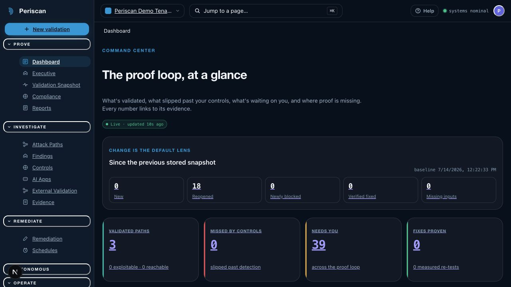
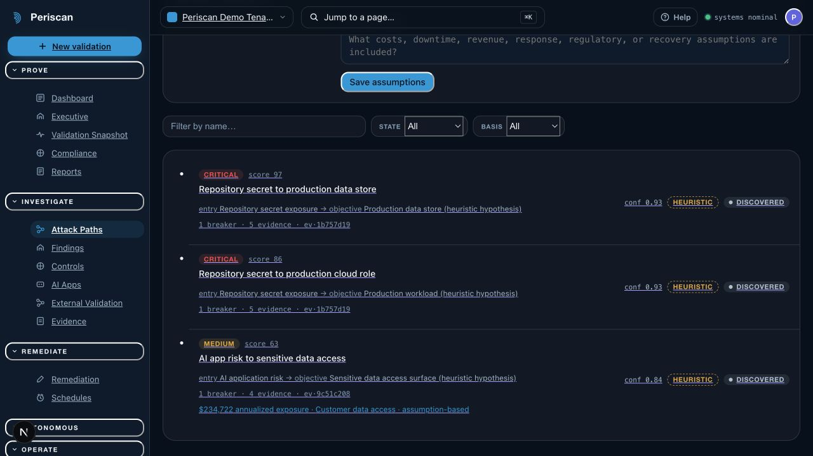
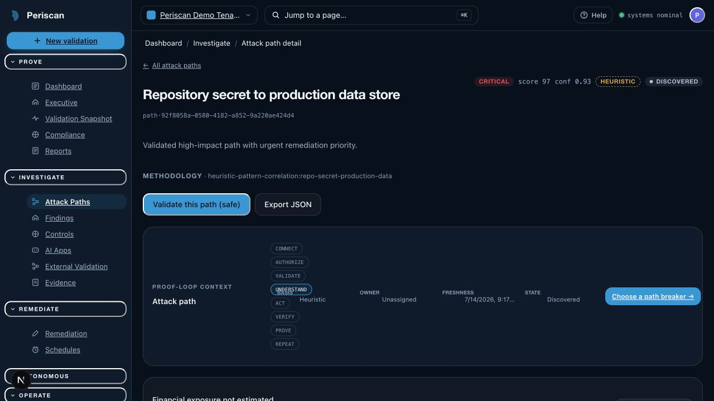
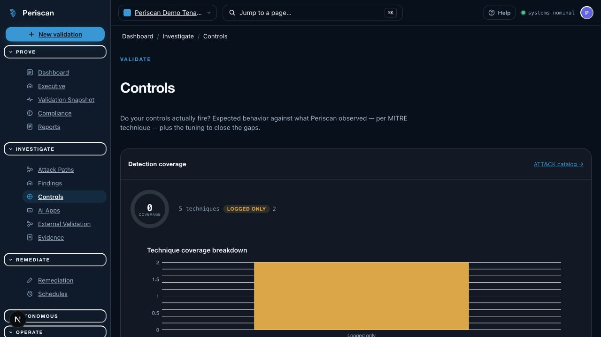
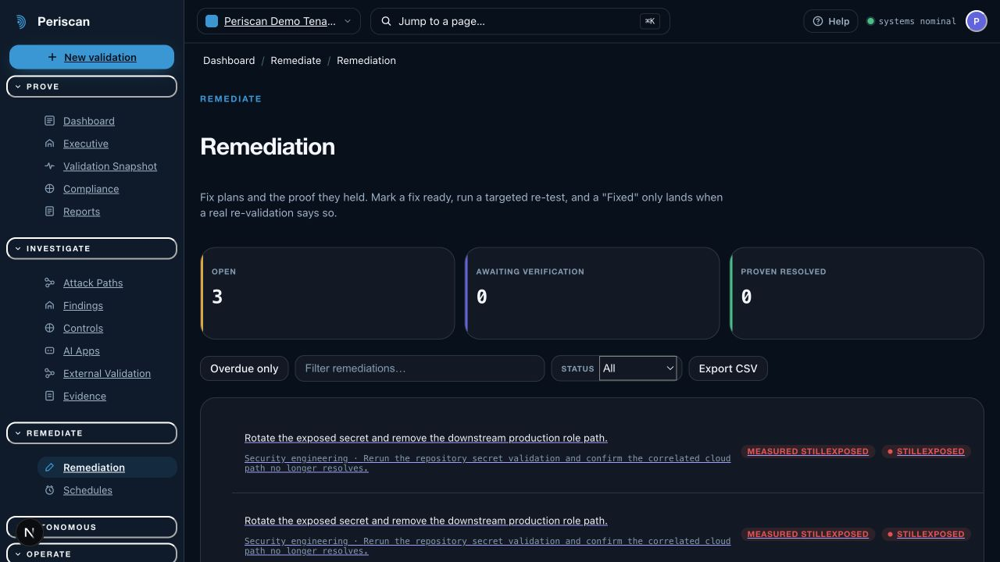
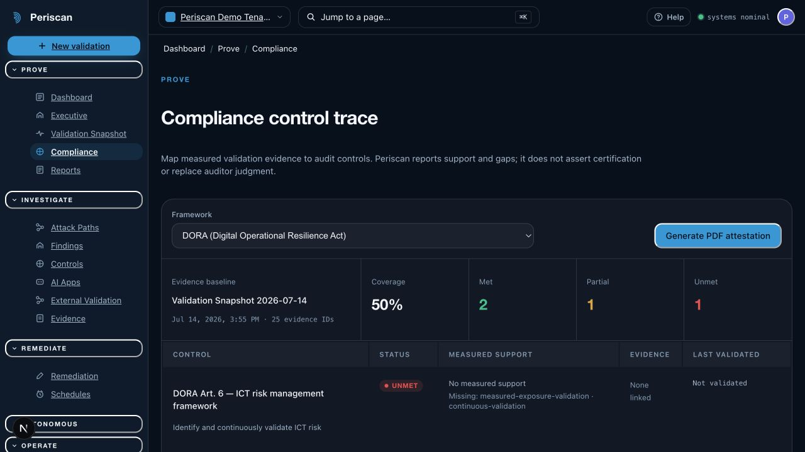
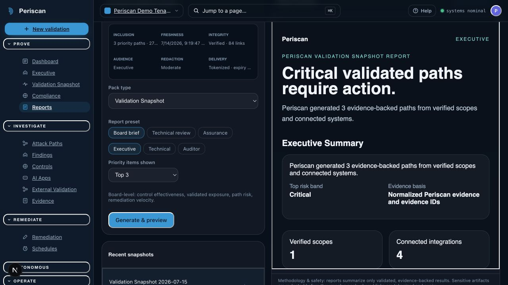
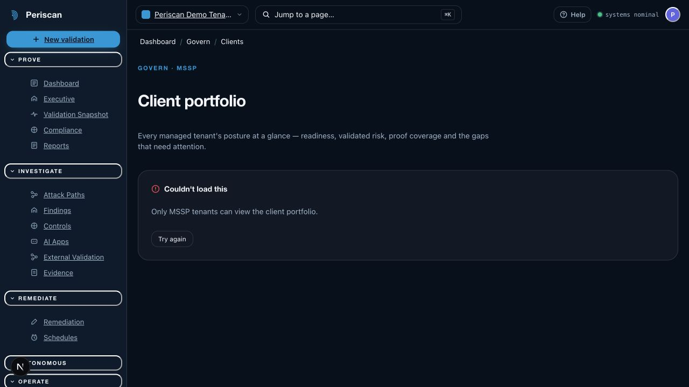

# Periscan analyst-requirements audit — updated 2026-07-16

## Executive verdict

Periscan is now assessed only against the 94 ASV/CTEM requirements in the
canonical core scorecard. A verified product behavior, configurable capability,
or explicit external dependency is not the same as proving that every external
service is configured or every production SLO is met. Its defensible lead
remains the evidence-native proof loop:
measured validation, explicit measured-versus-heuristic labeling, signed runner
results, revalidation that can reopen a stale fix, business-impact assumptions,
control-to-evidence compliance traces, tenant isolation, and broad real
read-only integrations.

Prior implementation waves added measured SCV/DRV/path
validation, graph-wide choke-point optimization, signed dynamic scenarios,
governed exact-diff remediation, bounded AI harnesses, durable agent workflows,
reviewed MCP/A2A interoperability, and execution-integrity verification.
Cross-organization AgentDID delegation now
binds W3C VC 2.0 credentials to reviewed A2A endpoints and signed receipts,
with DID key-rotation invalidation. Dedicated macOS/Linux detection analytics now
pair with a first-party signed-runner benign marker, a measured Kubernetes path
requires independent public-exposure and live failed-CIS evidence on the same
asset, and the data fabric exposes ownership confidence without turning a
candidate into authorized scope. Missing telemetry and imported clean reports
still never become proof. The custom-tool answer is now a tenant-scoped signed
OCI developer program with a hashed SDK scaffold, immutable compatibility and
review ledger, catalog activation, rollback, revocation, and an explicit
database-enforced zero-runtime-authority boundary.
The product-truth and task-complete external-validation slices are now closed.
Remaining gaps include measured path closure, finding deduplication,
control-effectiveness reconciliation, partner-qualified
credential/OT/human validation, and production operational evidence.

This audit therefore recommends two parallel positions:

1. Release and sell the **Find the path → Validate the risk → Prove it is
   fixed** workflow on the capabilities that are already real.
2. Build validation depth before adding breadth or adjacent platform work.

## Scoring method

| Status               | Credit | Meaning                                                                                                                      |
| -------------------- | -----: | ---------------------------------------------------------------------------------------------------------------------------- |
| **Verified E2E**     |   1.00 | Real API/service/persistence/UI path with acceptance or browser evidence for the claimed behavior.                           |
| **Functional**       |   0.80 | Real implementation exists, but customer credentials, deployment configuration, breadth, or production qualification remain. |
| **Partial**          |   0.50 | Useful product behavior exists, but a load-bearing part of the analyst wording is absent.                                    |
| **Guarded scaffold** |   0.25 | Contracts, imports, planning, dry-run, or fixtures exist; the claimed live behavior does not.                                |
| **Missing**          |   0.00 | No current product implementation. Some are intentionally excluded for safety or are partner/operations responsibilities.    |

The score is an implementation-coverage index, not a market rating or a claim
of production effectiveness. A connector with real API code and contract tests
is “Functional”; it is not described as validated against a customer's live
account unless that was actually exercised.

### Canonical score checkpoint

The machine-readable 94-row scorecard is authoritative: **1,487/1,880
(79.1/100)** current and **1,802/1,880 (95.9/100)** target. Original source IDs
remain stable; excluded adjacent rows cannot re-enter the score through the
score gate.

## Evidence base

The audit checked the current repository rather than relying on older coverage
documents. Important implementation anchors include:

- The shared product contracts and persisted domain in
  `packages/shared/src/domain.ts` and `packages/db/prisma/schema.prisma`.
- Real validation and correlation services in `apps/api/src/services`, with
  runner execution in `apps/runner` and validation modules in
  `packages/modules/src/index.ts`.
- Signed task/result provenance, nonce and expiry enforcement, and runner kill
  switches in `apps/api/src/services/runner.ts`, `packages/shared/src/runner.ts`,
  and the runner acceptance suite.
- Nessus, CSV, and SARIF normalization in
  `packages/connectors/src/scan-importers.ts`.
- Thirteen scheduled threat-feed adapters, cross-feed deduplication, provenance,
  and tenant correlation in `apps/api/src/threat-feeds`.
- Evidence-backed compliance mappings in
  `packages/reports/src/compliance-catalog.ts` for DORA, NIS2, SEC, GDPR, PCI
  DSS, ISO 27001, EU AI Act, ISO 42001, HIPAA, SOC 2, and NIST CSF.
- PERT-style financial exposure assumptions in `packages/evidence/src/risk.ts`
  and the asset/path valuation UI.
- The governed model gateway in `packages/model-gateway`, the persisted model
  session/tool/audit/usage records in Prisma, the MCP server in
  `apps/api/src/mcp/protocol.ts`, durable workflows in
  `apps/api/src/services/agent-workflows.ts`, and external trust in
  `apps/api/src/services/agent-trust.ts`.
- Functional and safety evidence in `tests/acceptance`, including measured
  revalidation, tenant isolation, model-tool denial, entitlement enforcement,
  scheduling, threat feeds, integrations, runner signing, and kill-switch flows.

Several older repository matrices are now stale: scan-file ingestion,
control-level compliance mapping, business-impact valuation, scheduled
multi-feed intelligence, and non-disruptive OT protocol exposure are all more
complete than those documents report.

## Verification result

The canonical database-backed `pnpm verify` gate passes on the current
confidential-compute assurance slice. It includes repository-wide
lint/typecheck; all package and application unit tests; the 53-route production
web build; Go runner and
local-lab validation; license, dependency, Prisma, migration, PRD, analyst, and
enum-drift gates; 94 Playwright journeys; 26 security-boundary tests; and 176
acceptance tests across 137 files. The web suite passes 83 files / 265 tests,
the API suite 28 files / 337 tests, the shared suite 30 files / 155 tests, and
the module suite 7 files / 176 tests. All 145 migrations deploy with no enum
drift. The browser
route sweep includes WCAG A/AA axe checks,
mobile overflow, contextual help, shared-shell navigation, the critical proof
journey, and the isolated demo-login journey.

The final hardening loop caught issues that focused tests alone could not: the
FinOps console was initially mounted in an unused legacy workbench; a Prisma
enum lacked a forward migration; four captions missed contrast; model-provider
web fixtures lagged the serving-capability contract; and the three new RTAP
tables used policy names the live isolation proof did not recognize. Each was
corrected and regression-tested. A forward migration standardized the RTAP RLS
policies, after which the live isolation proof and both direct RLS suites passed.
The help was exercised by component, accessibility, mobile-geometry, demo, and
workflow acceptance paths; the documented budget/rate, replay, PR, and
collaboration actions match their real API flows.

The TEE assurance live loop caught and fixed a Next bundler-incompatible shared
contract import and duplicated ordered-list numbering that focused service
tests did not expose. The final desktop and 390 px runs had no warning/error
console entries, no document or workspace overflow, and preserved the honest
disabled-decision state while the demo had no matching hardware receipt.

## The 94-requirement ASV/CTEM answer

Wave references point to
[ANALYST_REQUIREMENTS_2026_BUILD_PLAN.md](./ANALYST_REQUIREMENTS_2026_BUILD_PLAN.md).

### 1. Core CTEM and exposure validation

|   # | Analyst requirement                       | Status                      | Current Periscan answer                                                                                                                                                                                                                                                                                                                                                                     | Honest gap / build answer                                                                                                                                                                                                                                                   |
| --: | ----------------------------------------- | --------------------------- | ------------------------------------------------------------------------------------------------------------------------------------------------------------------------------------------------------------------------------------------------------------------------------------------------------------------------------------------------------------------------------------------- | --------------------------------------------------------------------------------------------------------------------------------------------------------------------------------------------------------------------------------------------------------------------------- |
|   1 | External Attack Surface Management (EASM) | **Functional**              | Verified-scope recon, DNS/HTTP discovery, external inventory connectors, Cortex Xpanse ingestion, normalized assets/signals, scheduling, and a persistence-backed ownership-confidence surface. Exact scope, inherited domains, and unattributed candidates derive from real scopes/assets/observations and expose lifecycle, sources, evidence, and provenance.                            | Discovery still expands from verified scope and connected sources. Add certificate-transparency/WHOIS/cloud pivots and human candidate-review actions; candidates must never become authorized scope automatically.                                                         |
|   2 | Dark Web & Credential Monitoring          | **Externally gated**        | Scheduled threat feeds and a real Intel 471 finished-intelligence connector exist. Enterprise readiness explicitly distinguishes that feed from credential matching.                                                                                                                                                                                                                        | A licensed breach-corpus contract, privacy-preserving match API, and rotation receipt are still required; the product makes no credential-exposure claim without them.                                                                                                      |
|   3 | Attack Path Validation (APV)              | **Verified measured slice** | Persisted graph/path UI carries per-edge evidence basis and measurement method. Runner-measured TCP/CORS edges form one measured path; independent authoritative public-exposure and live failed-Kubernetes-CIS signals form another only when both cite the same persisted asset and distinct evidence.                                                                                    | Other paths remain heuristic until each edge has fresh measurement; one qualified path never upgrades unrelated paths, and posture fusion remains `Validated` rather than `Exploitable`.                                                                                    |
|   4 | Choke Point Analysis                      | **Partial**                 | A greedy hitting-set / betweenness ranking over current persisted paths ranks shared remediable nodes, paths broken, collapse ratio, alternatives, and evidence basis. API surfaces the approximation disclaimer.                                                                                                                                                                          | Quality tracks upstream path honesty (many edges still Heuristic). Not a min-cut/dominator proof of a unique global optimum. Cap scorecard at Partial until multi-hop Measured is the default journey.                                                                      |
|   5 | Exposure Graphs                           | **Functional**              | Real persisted nodes/edges and interactive path topology with evidence, methodology, and ATT&CK context.                                                                                                                                                                                                                                                                                    | Expand topology/trust-zone semantics and measured-edge ratio; do not imply every edge is proven. W1.                                                                                                                                                                        |
|   6 | Security Control Validation (SCV)         | **Partial**                 | Telemetry pull + MITRE technique correlation from connected SIEM/EDR is real; tenant-scoped safe stimuli/canaries exist with policy/approval gates. Control-plane closed inject→measure remains **hard-disabled** (`control_live_execution_disabled`); Atomic is dry-run scenario import only, not live inject BAS.                                                                              | Do not claim continuous BAS-style inject efficacy until a policy-bound emit→observe loop is productized. Measured verdict still requires a configured observer; missing telemetry remains Inconclusive.                                                                      |
|   7 | URL Filtering Validation                  | **Verified E2E**            | The owned-domain URL canary executes a bounded benign request only against verified scope, then correlates fresh gateway telemetry into Prevented, Detected, TelemetryOnly, Missed, or Inconclusive with evidence.                                                                                                                                                                          | It never visits malicious infrastructure and does not enable Atomic live execution.                                                                                                                                                                                         |
|   8 | Detection Rule Validation (DRV)           | **Scaffold / Partial**      | Sigma/rule import, technique coverage counting, and marker **correlation** against supplied or live telemetry exist. Endpoint benign-marker emit is a separate runner stimulus. Closed inject-and-observe is **not** default product BAS.                                                                                                                                                      | Do not score DRV as Leading/Strong until emit→observe is one signed loop with rule-firing proof. Absent telemetry is Inconclusive; correlation-only modules must not claim they inject.                                                                                      |
|   9 | Cloud Security Validation (CSV)           | **Functional**              | Real Prowler execution, cloud posture connectors, IAM/config signals, and measured DigitalOcean fix verification exist.                                                                                                                                                                                                                                                                     | Expand live-account qualification and serverless/multi-cloud control tests. W2.                                                                                                                                                                                             |
|  10 | Kubernetes & Container Validation         | **Functional**              | Trivy scanning, K8s inventory/config signals, and CIS posture normalization are implemented. A live failed control bound to an asset can fuse with independent authoritative public-exposure evidence on that same asset into a measured path with per-edge provenance.                                                                                                                     | A supplied clean report remains unverified. Isolated safe cluster-breakout resistance simulation is still absent, and posture evidence never establishes exploitability.                                                                                                    |
|  11 | Exposure Validation (EXV)                 | **Verified E2E**            | Validation-aware exploitability scoring, evidence basis, trends, findings, paths, and executive summaries are persisted and tested.                                                                                                                                                                                                                                                         | Increase the share of upstream measurements; keep the certainty ladder visible.                                                                                                                                                                                             |
|  12 | Business Impact Scoring                   | **Verified E2E**            | A governed Business impact desk supplies four numeric-free scenario prompt sets, requires named source provenance, previews FAIR-inspired PERT/ALE without mutation, and persists immutable numbered versions with digest verification, administrator approval/rejection, audit, supersession, direct-update retirement, and tenant isolation. Only an approved version activates exposure. | Inputs remain customer planning assumptions, not measured loss history, actuarial advice, or a complete FAIR assessment. A 5.0 requires finance/risk model ownership, calibration, multiple customer qualifications, SLO/support evidence, and independent usability proof. |
|  13 | Dynamic Risk Dashboards                   | **Verified E2E**            | Persisted executive trend snapshots, change lens, proof-loop queue, validated-path metrics, remediations, and reports use real tenant data.                                                                                                                                                                                                                                                 | Validate information hierarchy with design partners and add configurable operational baselines in W0.                                                                                                                                                                       |
|  14 | macOS Detection Analytics                 | **Functional**              | A dedicated module correlates verified live macOS EDR/SIEM telemetry to platform techniques or the exact receipt from the governed first-party endpoint marker. `Missed` requires the matching macOS receipt and a completed observation window.                                                                                                                                            | Customer live-source qualification remains deployment work; missing or unhealthy telemetry stays Inconclusive.                                                                                                                                                              |
|  15 | Linux Detection Analytics                 | **Functional**              | The Linux module applies the same first-party marker receipt and strict live-source, platform, marker, and observation-window proof rules, with CrowdStrike, Defender XDR, and SentinelOne represented in readiness.                                                                                                                                                                        | Customer live-source qualification remains deployment work; missing or unhealthy telemetry stays Inconclusive.                                                                                                                                                              |

### 2. Autonomous penetration testing and BAS

|   # | Analyst requirement                    | Status                                | Current Periscan answer                                                                                                                                                                                                                                                                                                                                                                               | Honest gap / build answer                                                                                                                                                                                 |
| --: | -------------------------------------- | ------------------------------------- | ----------------------------------------------------------------------------------------------------------------------------------------------------------------------------------------------------------------------------------------------------------------------------------------------------------------------------------------------------------------------------------------------------- | --------------------------------------------------------------------------------------------------------------------------------------------------------------------------------------------------------- |
|  16 | Agentless APT Execution                | **Guarded scaffold**                  | Governed engagement planning and passive agentless probes exist; offensive kill-chain output is explicitly simulation-only.                                                                                                                                                                                                                                                                           | No autonomous exploitation. Build safe scenario execution in isolated/customer-owned ranges only, with hard policy ceilings, in W2.                                                                       |
|  17 | Agent-Based Execution                  | **Functional**                        | Outbound polling runners execute signed, scoped, expiring tasks; results are signed, verified, persisted, and kill-switchable.                                                                                                                                                                                                                                                                        | The current runner is deliberately safe and not a persistent lateral-movement implant. Extend safe endpoint/control packs, not stealth or persistence, in W1/W2.                                          |
|  18 | Agentless Web App Simulator            | **Functional safe slice**             | A real OWASP ZAP 2.17.0 passive baseline module runs against verified web scope. Its live qualification scans an ephemeral application through the production adapter, normalizes alerts, and proves the read-only-root, non-root, bounded-resource, passive-rule profile.                                                                                                                            | It is passive, not autonomous exploitation. Add authenticated safe checks and imported DAST evidence before considering isolated active testing. W2.                                                      |
|  19 | Data Exfiltration over DNS             | **Functional safe substitute**        | A live-capable DNS detection canary emits one synthetic, uniquely tagged query under a strict request ceiling and correlates it with supplied or live telemetry; evidence records that no real data was exfiltrated.                                                                                                                                                                                  | Periscan deliberately tests exfiltration detection, not real data theft. No customer data is encoded or moved.                                                                                            |
|  20 | Continually Updated Threat Library     | **Functional, signed execution path** | Thirteen scheduled feeds cover CISA KEV, NVD, EPSS, phishing, malware, advisories, IP reputation, and IOCs with dedup/provenance. Tenant-scoped scenario bundles compile safe implemented modules into versioned signed DAGs with ATT&CK IDs, source metadata, SBOM, safety/legal ceilings, expected observations, approval, exact-preview execution, recorded branch evidence, and tamper rejection. | Add curated promotion/deprecation, scenario-regression telemetry, and externally qualified library-update operations before claiming market-leading continuous curation.                                  |
|  21 | Ransomware Emulation                   | **Guarded scaffold**                  | Threat-intel ransomware flags (e.g. CISA KEV) and a kill-chain planner stage labeled “ransomware — not implemented; safety floor” exist. No dedicated ransomware module; `safeLiveModuleId` is null; live encrypt/delete is a hard never.                                                                                                                                                             | Do not market as ransomware emulation. Optional future: detection canary only (benign marker + EDR observe), never live crypto. Keep scorecard Scaffold/gated.                                                                                                            |
|  22 | Identity Abuse & Credential Harvesting | **Partial**                           | BloodHound-compatible graph import, identity connectors, secret scanning, and governed identity scenario manifests exist.                                                                                                                                                                                                                                                                             | Live credential abuse/harvesting is disabled. Build synthetic identities and customer-lab validation; never collect real credentials. W2/W5.                                                              |
|  23 | Dynamic Attack Paths                   | **Partial**                           | Signed scenario bundles can compile deterministic DAGs with approved branch predicates. Signal-triggered “next mission” remains advisory and human-gated.                                                                                                                                                                                                                                              | Not real-time path adaptation from live environmental context. Competitive matrix rates dynamic attack paths Scaffold for autonomous replan. Scorecard capped at Partial.                                                                                                 |
|  24 | Automated Unattended Scheduling        | **Verified E2E**                      | Daily/weekly/monthly mission and threat-feed schedules run per tenant, persist diffs, meter usage, and support pause/resume.                                                                                                                                                                                                                                                                          | Add sub-daily/event-driven triggers only after load and safety qualification. W6.                                                                                                                         |
|  25 | Software Supply Chain Security         | **Functional, live-qualified core**   | Native passive SSCS measures workflow policy, OIDC trust, artifact signing, provenance, and SLSA policy independently. Gitleaks, Trivy, and OSV risk evidence is now joined by live Syft CycloneDX inventory and Cosign 3.0.6 offline trusted-key verification; qualification proves both a valid artifact and a tampered-artifact rejection signal.                                                  | Repository/pipeline connector input and trust keys remain customer-configured; missing evidence domains remain visibly unmeasured, and the offline key profile does not claim transparency-log inclusion. |
|  26 | OT/ICS Attack Packs                    | **Externally gated**                  | A real non-disruptive module flags reachable industrial protocols only from supplied observations and never speaks to fragile protocols.                                                                                                                                                                                                                                                              | Partner-lab qualification is not configured, so Periscan correctly labels this passive validation rather than an OT attack pack.                                                                          |
|  27 | SSPM / SaaS Validation                 | **Functional**                        | Native posture rules plus dedicated Microsoft Entra, Google Workspace, Okta, and Salesforce connectors are implemented. The readiness UI distinguishes code availability from healthy tenant data.                                                                                                                                                                                                    | Additional provider-specific control depth must be added from authoritative connector fields; absent configuration remains Inconclusive.                                                                  |
|  28 | Crowdsourced Human-in-the-Loop         | **Externally gated**                  | Internal approvals and reviewer workflows exist; Enterprise readiness exposes the partner boundary.                                                                                                                                                                                                                                                                                                   | An approved partner contract, vetted identities, scope acknowledgement, evidence custody, and tested handoff are required before this can be enabled.                                                     |

### 3. Agentic AI and execution orchestration

|   # | Analyst requirement                | Status               | Current Periscan answer                                                                                                                                                                                                                                                                                                                                                                                                                                                                                                                                                                                                                                                              | Honest gap / build answer                                                                                                                                                                                                                                                                     |
| --: | ---------------------------------- | -------------------- | ------------------------------------------------------------------------------------------------------------------------------------------------------------------------------------------------------------------------------------------------------------------------------------------------------------------------------------------------------------------------------------------------------------------------------------------------------------------------------------------------------------------------------------------------------------------------------------------------------------------------------------------------------------------------------------ | --------------------------------------------------------------------------------------------------------------------------------------------------------------------------------------------------------------------------------------------------------------------------------------------- |
|  29 | Multi-Agent Orchestration Engine   | **Functional**       | Versioned tenant workflow DAGs link governed model sessions, typed tools, policy/evidence references, append-only state, and external exchange objects.                                                                                                                                                                                                                                                                                                                                                                                                                                                                                                                              | Specialist breadth remains intentionally driven by real proof-loop roles and reviewed capabilities rather than a fabricated agent count.                                                                                                                                                      |
|  30 | Hybrid Execution Compiler          | **Functional**       | The composer persists a validated versioned DAG from model, policy, scope, mode, goal, and deterministic context/policy/model/tool/evidence steps.                                                                                                                                                                                                                                                                                                                                                                                                                                                                                                                                   | Additional role templates can be added without changing the durable definition/event contract.                                                                                                                                                                                                |
|  31 | Dynamic Routing                    | **Functional core**  | Provider routes are tenant ordered and choose a fallback only at a safe pre-turn checkpoint; routing reason is persisted with each usage event.                                                                                                                                                                                                                                                                                                                                                                                                                                                                                                                                      | In-flight hot swap and unmeasured load/SLO scoring are intentionally absent.                                                                                                                                                                                                                  |
|  32 | Virtual Security Analyst           | **Functional**       | Real OpenAI/Anthropic adapters, typed evidence tools, redacted context, policy enforcement, approvals, audit, and kill switches exist.                                                                                                                                                                                                                                                                                                                                                                                                                                                                                                                                               | It is session-oriented rather than always available, and evaluation coverage is incomplete. Ship an evidence-citing analyst panel with a grounded evaluation set in W0/W2.                                                                                                                    |
|  33 | Conversational Threat Builder      | **Verified E2E**     | Operator language compiles into a typed, signed, versioned scenario DAG selected only from registered modules, with a human preview, exact hash, approval gate, integrity check, evidence-gated execution, and audit.                                                                                                                                                                                                                                                                                                                                                                                                                                                                | It is a constrained intent compiler, not permission to execute arbitrary model-generated prose or capabilities.                                                                                                                                                                               |
|  34 | Model Context Protocol Host/Client | **Verified E2E**     | The inbound tenant-scoped MCP server and outbound default-deny client lifecycle are implemented. Outbound discovery enforces reviewed endpoints, SSRF guards, bounded JSON, schema hashes, and explicit tool imports.                                                                                                                                                                                                                                                                                                                                                                                                                                                                | Authenticated partner transports beyond public-key receipts should be added per contracted endpoint, never as generic stored credentials.                                                                                                                                                     |
|  35 | Agent-to-Agent (A2A) Protocol      | **Operational core** | Reviewed A2A endpoints persist structural conformance and can now run the pinned official A2A TCK under verified scope, tenant policy, explicit active-traffic acknowledgement, and audited authorization. Normalized MUST/SHOULD/MAY and transport results are hash-sealed in the trust UI.                                                                                                                                                                                                                                                                                                                                                                                         | A real partner implementation must still pass its own approved run; Periscan does not convert the controlled qualification server's failures into partner proof.                                                                                                                              |
|  36 | A2A Agent Cards                    | **Operational core** | Discovery validates required identity, ordered interface URL/binding/version declarations, content modes, skill contracts, capabilities, security-scheme references, signature presence, and HTTPS posture. Official TCK qualification is available only after structural conformance passes.                                                                                                                                                                                                                                                                                                                                                                                        | JWS signatures remain present-but-unverified until a partner key profile is configured; structural discovery is not live behavior proof.                                                                                                                                                      |
|  37 | A2A Task & Message Objects         | **Operational core** | Tenant-scoped typed objects remain redacted, idempotent, lifecycle-validated, persisted, and exposed through authenticated SSE snapshots. The official TCK can now exercise selected JSON-RPC, HTTP+JSON, and gRPC behavior and persists failed or untested MUST requirements explicitly.                                                                                                                                                                                                                                                                                                                                                                                            | Cross-organization delivery is credited only after the selected partner endpoint passes the governed TCK run.                                                                                                                                                                                 |
|  38 | A2A Artifact Exchange              | **Functional**       | Artifact objects require verified signed receipts under tenant policy and bind sender workload, payload digest, nonce, expiry, audience, and evidence IDs.                                                                                                                                                                                                                                                                                                                                                                                                                                                                                                                           | Raw evidence is never embedded; only authorized redacted references cross the boundary.                                                                                                                                                                                                       |
|  39 | Immutable Event-Sourced Ledger     | **Functional**       | Versioned workflow runs persist append-only, sequence-unique, hash-chained events for redacted manifests, provider/model, tool/policy/evidence refs, cost, latency, and checkpoints.                                                                                                                                                                                                                                                                                                                                                                                                                                                                                                 | Prompt/response text is intentionally minimized; references and hashes preserve diagnostic value without secret retention.                                                                                                                                                                    |
|  40 | Time-Travel Debugging              | **Functional**       | Operators can seal checkpoints, verify the event chain, and fork a new run that reuses upstream history only when input, policy, evidence, and expiry remain valid.                                                                                                                                                                                                                                                                                                                                                                                                                                                                                                                  | Replay never mutates the source run and never replays tool side effects.                                                                                                                                                                                                                      |
|  41 | Historical Variable Analysis       | **Verified E2E**     | Variable Lens derives tenant-scoped cumulative snapshots from the persisted redacted input manifest and hash-linked recorder, then compares any two moments across Input, Context, Policy, Evidence, Model, Tool, Transition, Performance, and Control state. Change-density bars, family filtering, bounded before/after previews, SHA-256 exact-value proof, integrity state, inline help, and a clearly labeled no-inference demo are implemented.                                                                                                                                                                                                                                | Deliberately unrecorded secrets and raw prompts cannot be reconstructed. A 5.0 requires independent multi-customer usability evidence, long-history performance/retention qualification, and externally reviewed support/SLO operation.                                                       |
|  42 | Programmatic HITL Interrupts       | **Verified E2E**     | High-risk tool calls pause in `RequiresApproval`; tenant administrators can issue a signed, expiring, one-time handoff that binds the exact request, session, policy, scope, input commitment, transport label, and expiry. The reviewer re-verifies that envelope before an atomic resume or cancel decision; resume only moves the request to `Approved` and never executes it. Raw tokens are not persisted, plain messages have no authority, and expiry, supersession, tamper, changed envelopes, and replay fail closed with audit evidence. The queue, decision rail, contextual guide, safe demo, tenant/RLS controls, and database-backed acceptance proof are implemented. | A 5.0 requires independent multi-customer usability, externally reviewed support/SLO operation, and qualified enterprise message delivery. Slack and Teams are honest transport labels in this release, not configured delivery integrations and never approval authorities.                  |
|  43 | Continuous Feedback Loops          | **Verified E2E**     | Approved scenario graphs now operate as durable, human-triggered feedback cycles. The signed iteration limit, atomic cycle reservation, optimistic stale-state guard, per-cycle engagement attribution, fresh prior-step branch facts, failed-attempt accounting, terminal stop/exhaustion, audit actions, strict tenant RLS, control-room UI, contextual help, demo bundle, and operator runbook are database-backed and acceptance-tested.                                                                                                                                                                                                                                         | Feedback can choose only reviewed branches. Self-modifying policy, tool invention, scope expansion, silent retries, and unbounded autonomous replanning remain prohibited. A 5.0 claim still requires independent multi-customer usability evidence and production support/SLO qualification. |

### 4. Execution integrity and non-human identity

|   # | Analyst requirement               | Status                               | Current Periscan answer                                                                                                                                                                                                                                                                                                                                                                                                                                                                                                                                                                                | Honest gap / build answer                                                                                                                                                                                                                                          |
| --: | --------------------------------- | ------------------------------------ | ------------------------------------------------------------------------------------------------------------------------------------------------------------------------------------------------------------------------------------------------------------------------------------------------------------------------------------------------------------------------------------------------------------------------------------------------------------------------------------------------------------------------------------------------------------------------------------------------------ | ------------------------------------------------------------------------------------------------------------------------------------------------------------------------------------------------------------------------------------------------------------------ |
|  44 | Hardware-Rooted TEE Execution     | **Verified relying-party lifecycle** | A governed Veraison challenge-response flow for Arm PSA, Arm CCA, AMD SEV-SNP, and TPM now feeds an immutable deployment-assurance register. Each requirement binds verified scope, workload, provider, policy decision, freshness/validity, optional exact claims, support owner, and escalation. Deterministic Qualified/Rejected receipts bind normalized evidence hashes; expiry degrades automatically; revocation is append-only; RLS, tenant guards, audit, contextual help, an honest evidence-free demo, and database-backed acceptance proof cover operation without retaining raw evidence. | Periscan proves the relying-party lifecycle, not execution on customer hardware. Veraison trust anchors, endorsements, a real attester/TEE, independent multi-customer usability, and externally reviewed production support/SLO evidence remain required for 5.0. |
|  47 | Execution Integrity               | **Verifier operational core**        | Signed native claims and Veraison results bind workload, verified scope, policy decision, verifier origin, one-use challenge, evidence hash, result-claims hash, expiry, and optional dotted claim expectations. The UI separates verified, rejected, processing, and not-configured certainty states.                                                                                                                                                                                                                                                                                                 | Controlled protocol qualification proves the relying-party implementation, not execution on real customer TEE hardware; ordinary OCI signatures still do not qualify.                                                                                              |
|  48 | Tool-Call Integrity               | **Functional core**                  | Runner signatures plus inter-agent signed receipts bind payload digest, SPIFFE sender, nonce, TTL, audience, and evidence references.                                                                                                                                                                                                                                                                                                                                                                                                                                                                  | Hardware-backed end-to-end proof is present only when a verified deployment attestation also exists.                                                                                                                                                               |
|  49 | Message Authenticity & Provenance | **Functional**                       | A2A receipts cryptographically bind sender workload identity, payload/artifact digest, audience, nonce, expiry, endpoint, and evidence provenance. Endpoint policy can additionally require a verified W3C VC delegation for the same endpoint and SPIFFE workload.                                                                                                                                                                                                                                                                                                                                    | External partner messaging still requires its governed endpoint, issuer, and credential lifecycle to be qualified.                                                                                                                                                 |
|  50 | Freshness Attestation             | **Verified E2E**                     | Runner tasks, agent receipts, and confidential attestations enforce nonce, expiry, issued-at windows, and replay rejection.                                                                                                                                                                                                                                                                                                                                                                                                                                                                            | Production clock-skew policy should be monitored with the selected identity/provider infrastructure.                                                                                                                                                               |
|  51 | AgentDID Integration              | **Strong relying-party core**        | Tenant-approved did:web issuer/subject profiles bind verified scope, policy, A2A endpoint, audience, type, SPIFFE workload, TTL, and capability subset. VC 2.0 vc+jwt verifies the issuer assertion key; raw credentials/documents are not stored; receipt policy, key-rotation revocation, and tenant revocation are enforced.                                                                                                                                                                                                                                                                        | Partner-operated issuer, wallet, DNS/TLS, credential-status method, and production endpoint conformance still require external qualification.                                                                                                                      |
|  52 | Short-Lived Credential Issuance   | **Functional core**                  | External agent receipts are sender-bound, audience-bound, capped at a five-minute tenant TTL, and one-time-nonce protected.                                                                                                                                                                                                                                                                                                                                                                                                                                                                            | Full SPIRE issuance/rotation is deployment infrastructure, not simulated by Periscan.                                                                                                                                                                              |
|  53 | NHI Sprawl Discovery              | **Functional**                       | A tenant-scoped secret-free machine identity graph covers service accounts, OAuth clients/tokens, API keys, workload roles, certificates, owners, privilege, last-use, rotation, expiry, exposure, and resource edges.                                                                                                                                                                                                                                                                                                                                                                                 | Automated provider-specific ingestion depth should continue to expand; the API rejects plaintext secret fields and stores only hashes/fingerprints.                                                                                                                |
|  54 | Agent Behavior Analytics          | **Functional**                       | The live workflow event stream is evaluated by explainable deterministic rules for denied-tool pressure, approval bypass attempts, scope expansion, repeated failure, iteration growth, evidence churn, and cost/latency outliers; the UI exposes baselines, finding evidence, severity, and action.                                                                                                                                                                                                                                                                                                   | It intentionally does not claim a trained anomaly model; deterministic findings remain reviewable and testable.                                                                                                                                                    |
|  57 | Priority Lanes for Validation     | **Functional core**                  | Standard and explicitly enabled Priority lanes are persisted on every model turn; unauthorized priority requests fail before queueing and tenant concurrency fairness still applies.                                                                                                                                                                                                                                                                                                                                                                                                                   | This must be applied to security validation and runner queues; production scheduling SLO evidence remains outstanding.                                                                                                                                             |

### 5. Offensive security for AI

|   # | Analyst requirement           | Status                   | Current Periscan answer                                                                                                                                                                                                                   | Honest gap / build answer                                                                                                                                       |
| --: | ----------------------------- | ------------------------ | ----------------------------------------------------------------------------------------------------------------------------------------------------------------------------------------------------------------------------------------- | --------------------------------------------------------------------------------------------------------------------------------------------------------------- |
|  59 | AI Control Validation         | **Verified safe E2E**    | Authorized AI endpoints run bounded, versioned Periscan suites for injection, leakage, RAG, tool, guardrail, abuse, and extraction-resistance categories; imported Promptfoo/PyRIT/Garak reports share the same normalized evidence path. | The product never labels an imported or benign-probe outcome as broader live adversarial proof.                                                                 |
|  60 | Model-Aware Threat Simulation | **Functional**           | App type, RAG/tool state, corpus version, category, request/response/timeout ceilings, redaction, endpoint scope, and per-test evidence make the suite model- and application-aware.                                                      | Provider/model-specific breadth grows through reviewed versioned corpora; arbitrary offensive prompts are excluded.                                             |
|  61 | Prompt Injection Emulation    | **Verified safe E2E**    | Direct and indirect injection categories execute bounded synthetic canaries against a verified customer-authorized endpoint, persist redacted evidence, and enforce request budgets.                                                      | This validates defined canaries and cannot imply universal prompt-injection resistance.                                                                         |
|  62 | Jailbreak Validation          | **Functional**           | A versioned guardrail-bypass category runs through the bounded suite, while safe Garak/PyRIT report imports normalize third-party campaign results with provenance.                                                                       | Large or higher-risk multi-turn corpora remain explicit, approval-gated customer test campaigns.                                                                |
|  63 | RAG Poisoning Emulation       | **Verified safe E2E**    | The RAG-poisoning-resistance category uses disposable synthetic-document instructions, verified RAG app scope, tight budgets, redacted evidence, and a local-endpoint acceptance path.                                                    | Periscan never writes to an unapproved production vector namespace; customer-specific cleanup proof is required when a real disposable namespace is configured. |
|  64 | Model Weight Extraction Tests | **Safe resistance test** | A non-exfiltrating extraction-resistance suite tests rate limiting, repeated-query consistency, excessive detail, and response leakage with strict request/byte ceilings and evidence.                                                    | Actual model-weight theft is prohibited; this is an abuse-resistance control test, not extraction.                                                              |
|  65 | AI Kill-Switch Validation     | **Verified E2E**         | The kill-switch drill persists activation, reason, acknowledgement state, last task, and an audited zero-post-kill-task count; later runs fail before a validation run or endpoint request is created.                                    | Production drills still depend on the customer's authorized endpoint and operating cadence.                                                                     |

### 6. Remediation operations and unified data fabric

|   # | Analyst requirement             | Status                    | Current Periscan answer                                                                                                                                                                                                                                                                         | Honest gap / build answer                                                                                                                                                   |
| --: | ------------------------------- | ------------------------- | ----------------------------------------------------------------------------------------------------------------------------------------------------------------------------------------------------------------------------------------------------------------------------------------------- | --------------------------------------------------------------------------------------------------------------------------------------------------------------------------- |
|  66 | Unified Data Fabric             | **Functional**            | Connector assets/signals, Nessus/CSV/SARIF imports, OCSF mapping, correlation, entity resolution, source conflicts, lineage, and evidence graph use shared contracts. The workspace exposes ownership status/confidence, lifecycle, source/evidence counts, and provenance from persisted data. | Add EASM candidate-review actions and broader import-workflow polish; source-resolution confidence must remain distinct from ownership authorization.                       |
|  67 | Auto-Mitigate                   | **Verified governed E2E** | Narrow allowlisted actions use typed manifests, exact preview hashes, role approval, idempotent execution receipts, rollback, connector permission checks, audit, and mandatory revalidation.                                                                                                   | Periscan does not expose a generic `executeFix`; unsupported targets remain recommendation-only.                                                                            |
|  68 | Prescriptive Mitigation Planner | **Functional**            | Findings/path breakers generate ordered remediation and revalidation steps with stack-aware context.                                                                                                                                                                                            | Expand from deterministic templates to evidence-citing model refinement and alternative/impact comparison. W2/W4.                                                           |
|  69 | Automated Revalidation          | **Verified E2E**          | Scheduled and user-triggered re-tests produce measured Fixed/Still Exposed outcomes and can reopen stale fixes.                                                                                                                                                                                 | Add event-driven triggers after governed changes and stronger stale-evidence policy in W1/W4.                                                                               |
|  70 | Infrastructure-as-Code Updates  | **Verified E2E**          | A real GitHub integration fetches the exact current file/SHA, scans replacement content for secrets, produces an immutable unified diff and preview hash, requires approval, creates one branch/commit/PR, refreshes checks/merge state, and links merged state to revalidation.                | Periscan never merges the PR; rollback closes an unmerged PR and deletes its branch, while merged changes require a new governed reversal.                                  |
|  71 | ITSM/SOAR Automation            | **Functional**            | Jira, ServiceNow, GitHub Issues, PagerDuty, Opsgenie, Slack, and related integrations create or route work with evidence references.                                                                                                                                                            | Deep SOAR playbook triggering, callback state, deduplication, and bidirectional closure are uneven. W4.                                                                     |
|  72 | CrowdStrike Integration         | **Functional**            | Real OAuth/API client, detection retrieval, normalized telemetry, health checks, and contract tests exist.                                                                                                                                                                                      | Currently read-oriented; governed prevention-policy changes belong in W4 only with preview/rollback.                                                                        |
|  73 | Palo Alto XSIAM Integration     | **Partial**               | Real Cortex XDR incident/observer support exists.                                                                                                                                                                                                                                               | XSIAM-specific coverage and policy/write lifecycle are absent. Deepen/brand accurately in W4.                                                                               |
|  74 | Wiz / CSPM Integration          | **Functional**            | Real OAuth/GraphQL resource and issue ingestion, health, normalization, and contract coverage exist.                                                                                                                                                                                            | Add tested incremental sync and remediation reference links in W4.                                                                                                          |
|  75 | Datadog Integration             | **Functional**            | Real API health/telemetry ingestion and SIEM mapping exist.                                                                                                                                                                                                                                     | Expand detection-event validation/correlation in W1/W4.                                                                                                                     |
|  76 | Tenable / RBVM Integration      | **Functional**            | Real asset/vulnerability ingestion plus Nessus file import and correlation exist.                                                                                                                                                                                                               | Add incremental sync, exception context, and measured exploitability writeback only if safely supported. W4.                                                                |
|  77 | IBM QRadar Integration          | **Functional**            | Real Ariel search lifecycle, health, normalized observations, secret redaction, and contract tests exist.                                                                                                                                                                                       | Add DRV test-event correlation and optional governed rule recommendation workflow. W1/W4.                                                                                   |
|  78 | VMware vCenter Integration      | **Functional**            | A dedicated vSphere Automation API connector creates a session with a read-only account, health-checks bounded inventory reads, and normalizes datacenters, clusters, ESXi hosts, networks, VMs, power/connection state, topology identifiers, assets, and redacted signals.                    | Live use requires customer vCenter credentials with inherited Read-only visibility; Periscan exposes no power, create, reconfigure, migrate, snapshot, or delete operation. |
|  79 | Continuous Intelligence Feed    | **Verified E2E**          | Thirteen feed adapters poll on schedule, deduplicate cross-source items, retain provenance/freshness, and correlate IOCs/CVEs to tenant scope.                                                                                                                                                  | Add source quality/SLA UI and signed scenario promotion; do not call feed presence validation proof. W2.                                                                    |

### 7. Business reporting, compliance, MSSP, and GTM

|   # | Analyst requirement                | Status           | Current Periscan answer                                                                                                                                                                                                                                                                                                                                                                                                                                                                                                                                                                                                                                                            | Honest gap / build answer                                                                                                                                                                                                                                                                                                                                                                         |
| --: | ---------------------------------- | ---------------- | ---------------------------------------------------------------------------------------------------------------------------------------------------------------------------------------------------------------------------------------------------------------------------------------------------------------------------------------------------------------------------------------------------------------------------------------------------------------------------------------------------------------------------------------------------------------------------------------------------------------------------------------------------------------------------------- | ------------------------------------------------------------------------------------------------------------------------------------------------------------------------------------------------------------------------------------------------------------------------------------------------------------------------------------------------------------------------------------------------- |
|  80 | Automated Compliance Attestations  | **Functional**   | Control catalogs map measured evidence kinds to Met/Partial/Unmet, trace evidence IDs and freshness, and generate governed reports.                                                                                                                                                                                                                                                                                                                                                                                                                                                                                                                                                | Periscan is not a certifying authority. Add versioned framework content, reviewer sign-off, and control-owner workflows in W5.                                                                                                                                                                                                                                                                    |
|  81 | EU AI Act Alignment                | **Functional**   | Article-level AI cybersecurity/risk mappings consume AI-control and continuous-validation evidence.                                                                                                                                                                                                                                                                                                                                                                                                                                                                                                                                                                                | Expand coverage with legal review and AI-system documentation inputs. W3/W5.                                                                                                                                                                                                                                                                                                                      |
|  82 | ISO 42001 Mapping                  | **Functional**   | AI impact/security controls map to AI validation and evidence integrity.                                                                                                                                                                                                                                                                                                                                                                                                                                                                                                                                                                                                           | Expand the control set and reviewer workflow; never state certification. W3/W5.                                                                                                                                                                                                                                                                                                                   |
|  83 | DORA Evidence Generation           | **Functional**   | Article-level ICT risk, TLPT, detection, recovery, and integrity mappings produce control trace.                                                                                                                                                                                                                                                                                                                                                                                                                                                                                                                                                                                   | Add entity-specific scoping, reviewer evidence requests, and regulatory update lifecycle. W5.                                                                                                                                                                                                                                                                                                     |
|  84 | NIS2 Compliance Reporting          | **Functional**   | Article 21 mappings cover risk analysis, incident handling, and effectiveness testing.                                                                                                                                                                                                                                                                                                                                                                                                                                                                                                                                                                                             | Expand jurisdiction/profile overlays and legal content review. W5.                                                                                                                                                                                                                                                                                                                                |
|  85 | SEC Cybersecurity Rules Mapping    | **Functional**   | Item 106 risk/strategy and third-party oversight map to measured exposure/continuous/path evidence.                                                                                                                                                                                                                                                                                                                                                                                                                                                                                                                                                                                | Materiality remains a management/legal decision; add approved narrative controls, not automated assertions. W5.                                                                                                                                                                                                                                                                                   |
|  86 | PCI DSS Validation Reporting       | **Functional**   | Requirements 10 and 11 mappings link logging, vulnerability, penetration, and fix evidence.                                                                                                                                                                                                                                                                                                                                                                                                                                                                                                                                                                                        | Add scope/system-component filters and assessor review workflow. W5.                                                                                                                                                                                                                                                                                                                              |
|  87 | HIPAA Validation Reporting         | **Functional**   | Security Rule risk-analysis and related controls are mapped in the compliance catalog.                                                                                                                                                                                                                                                                                                                                                                                                                                                                                                                                                                                             | Add covered-entity/business-associate profiles and evidence-request workflow. W5.                                                                                                                                                                                                                                                                                                                 |
|  88 | ISO 27001 Validation Reporting     | **Functional**   | Annex A vulnerability, monitoring, and threat-intelligence mappings are implemented.                                                                                                                                                                                                                                                                                                                                                                                                                                                                                                                                                                                               | Expand control coverage and statement-of-applicability linkage. W5.                                                                                                                                                                                                                                                                                                                               |
|  89 | GDPR Data Isolation Proof          | **Functional**   | A dedicated proof pack inspects every tenant table for enabled/forced RLS and tenant policy, verifies the evidence chain, and records region, encryption, credential, and report-share configuration.                                                                                                                                                                                                                                                                                                                                                                                                                                                                              | It is an operational proof artifact, not a legal certification or substitute for a DPA.                                                                                                                                                                                                                                                                                                           |
|  90 | CISO / Board-Level Risk Dashboards | **Verified E2E** | Outcome-first command center, change lens, validated path exposure, control misses, remediation, proof readiness, and drill-down are live.                                                                                                                                                                                                                                                                                                                                                                                                                                                                                                                                         | Continue design-partner validation; keep assumption labels and evidence drill-down. W0.                                                                                                                                                                                                                                                                                                           |
|  91 | Multitenant MSSP Architecture      | **Verified E2E** | MSSP/client hierarchy, tenant isolation, role gates, portfolio rollups, readiness, branded reports, and client metering are persisted/tested.                                                                                                                                                                                                                                                                                                                                                                                                                                                                                                                                      | Qualify the actual portfolio UI in an MSSP demo tenant and add RLS/operational assurance. W0/W5.                                                                                                                                                                                                                                                                                                  |
|  92 | Short-Term Assessment Licensing    | **Verified E2E** | Time-boxed assessment/trial entitlements, one-time eligibility, fail-closed expiry, prior-plan restoration, cancellation, retention review, approved conversion, usage meters, API/UI, and audit are persisted and tested.                                                                                                                                                                                                                                                                                                                                                                                                                                                         | Contract/payment collection remains outside Periscan until a processor and commercial terms are approved.                                                                                                                                                                                                                                                                                         |
|  93 | Long-Term Continuous Subscriptions | **Verified E2E** | A tenant-scoped direct-agreement lifecycle now governs active, grace, non-renewing, and ended states; review checkpoints; approved or declined renewals; immutable scheduled/open/closed periods; real period usage snapshots; bounded grace; typed end-of-term cancellation and recovery; fail-closed entitlement removal; hash-linked history; audit; API/UI/help; and tenant isolation.                                                                                                                                                                                                                                                                                         | Payment charging, tax, invoices, settlement, and procurement remain explicitly `NotConfigured`. Reaching 5.0 still requires a reviewed processor/invoice integration plus live reconciliation, dunning, support, and customer qualification; none is inferred from the term ledger.                                                                                                               |
|  94 | Self-Serve Free Trials             | **Functional**   | One-time, time-boxed real-tenant trial entitlements, fail-closed expiry, prior-plan restoration, retention scheduling, cancellation, and approval-bound conversion are implemented.                                                                                                                                                                                                                                                                                                                                                                                                                                                                                                | Payment processing is intentionally not claimed or configured.                                                                                                                                                                                                                                                                                                                                    |
|  96 | Localized Go-to-Market Features    | **Verified E2E** | Five exact, versioned product-shell and Snapshot-report catalogs now expose key-level coverage, zero-fallback assurance, and SHA-256 digests. Administrators can preview locale/timezone formatting without mutation, then activate a reviewed immutable release with support ownership, audit provenance, in-place navigation/HTML-language refresh, locale-aware report formatting, and a permanent activation ledger. Database-backed acceptance proves invalid-timezone and missing-review denial, Japanese activation, English recovery, semantic invariants, and tenant isolation; the rendered guide was followed through localized report generation on desktop and 390px. | This is a governed presentation release, not automatic long-tail translation. Page bodies, inline help, customer evidence, regulatory/tax/legal content, procurement, data residency, and cross-border authorization remain unchanged unless separately reviewed. Reaching 5.0 still requires legally reviewed long-tail regional catalogs plus live regional support and customer qualification. |
|  97 | White-Labeling for GSIs            | **Functional**   | Tenant branding and governed report branding are implemented.                                                                                                                                                                                                                                                                                                                                                                                                                                                                                                                                                                                                                      | Add custom domain/email/theme governance and immutable “Powered by/evidence source” disclosure policy. W5.                                                                                                                                                                                                                                                                                        |
|  98 | Marketplace Interoperability       | **Functional**   | Public OpenAPI, inbound/outbound MCP, A2A exchange contracts, connector/module manifests, and a cryptographically signed OCI extension compatibility harness provide reviewed extension points.                                                                                                                                                                                                                                                                                                                                                                                                                                                                                    | Compatibility never auto-authorizes execution; catalog, license/dependency, security, install/upgrade/rollback, and partner review remain explicit gates.                                                                                                                                                                                                                                         |

### 8. Operational resilience and extension governance

|   # | Analyst requirement            | Status                           | Current Periscan answer                                                                                                                                                                                                                                                                                                                                                                                                                  | Honest gap / build answer                                                                                                                                                                                                                                                   |
| --: | ------------------------------ | -------------------------------- | ---------------------------------------------------------------------------------------------------------------------------------------------------------------------------------------------------------------------------------------------------------------------------------------------------------------------------------------------------------------------------------------------------------------------------------------- | --------------------------------------------------------------------------------------------------------------------------------------------------------------------------------------------------------------------------------------------------------------------------- |
| 107 | Asynchronous Task Processing   | **Strong, locally operated**     | Schedules, durable queues, signed runner polling, leases, retries, workers, fair-share/priority lanes, reviewed tenant thresholds, live queue health, tenant-scoped stale-work reconciliation, fresh policy-gated recovery drafts, audit, forced RLS, and a hash-linked immutable decision ledger are real. The database-backed exercise covers jobs and runner tasks; the seeded demo and route-specific guide cover operator recovery. | Production-like multi-node failure, soak, externally reviewed SLO/support attainment, and 10,000+ concurrency qualification remain unproven and unclaimed.                                                                                                                  |
| 110 | Custom Tool Creation Framework | **Functional developer program** | Tenant projects generate a deterministic five-file hashed SDK scaffold; immutable signed OCI contracts persist compatibility findings and support human certification/rejection, one active catalog version, atomic upgrade/rollback, revocation, audit history, tenant isolation, and a best-in-class release-rail UI with inline help. The API and database keep `executionAuthorized` false.                                          | Arbitrary Python/source upload remains prohibited. Catalog activation is not runner authority; executable third-party adapters still require a reviewed module binding, license/security review, verified scope, policy, runner eligibility, and a supported evidence path. |

## UI/UX audit of the current analyst-critical journey

### 1. Command center — **Healthy, with density risk**

The opening screen leads with change, validated paths, work requiring attention,
verified fixes, and proof readiness. It avoids a generic scanner-dashboard feel
and preserves measured/heuristic truth. The next improvement is stronger
progressive disclosure for first-time users and a clearer single primary action.

### 2. Attack paths and business impact — **Governed and progressively disclosed**

Assumption-based annualized exposure is explicit and the path cards label
evidence basis and discovery state. The Business impact desk now keeps its
editor collapsed until requested, presents current approved exposure and the
permanent version ledger first, and leaves the actual prioritized paths ahead
of the graph-wide optimizer. Scenario prompts supply no benchmark dollars;
source ownership, preview, review, activation, integrity, and model boundaries
remain visible in one task flow. The rendered workflow passed desktop and 390px
overflow checks.

### 3. Attack-path detail — **Evidence-rich, one release bug found and fixed**

The detail view shows topology, risk contribution, path breaker, reachability,
exploitability, evidence IDs, and safe validation action. The live browser audit
found that the design token `#ffffff38` was passed to Cytoscape, which rejects
eight-digit hex for line/arrow colors. The UI now converts that token to `rgba`
and has a focused regression test.

### 4. Control validation — **Honest and useful; stimulus loop is the product gap**

Coverage, expected versus observed outcomes, ATT&CK mapping, history, and tuning
recommendations are clear. The screen correctly states that Atomic live
execution is disabled. That honesty is good UX, but it also makes the W1
inject-and-observe work the most important capability gap.

### 5. Remediation — **Best-in-class truth model; needs action depth**

Open, Awaiting Verification, Proven Resolved, and measured Still Exposed states
are unambiguous. The interface never calls a fix complete without fresh proof.
The next innovation is a previewable path-breaker action with rollback and
automatic measured revalidation—not a misleading “magic fix” button.

### 6. Compliance trace — **Healthy and unusually credible**

Per-control Met/Partial/Unmet state, required/missing evidence kinds, evidence
IDs, and freshness make the report defensible. The UI also correctly disclaims
certification. Keep framework version, content owner, and review date visible as
the catalog expands.

### 7. Proof composer — **Healthy, high-value workflow**

The generated validation snapshot was created from current tenant data and
rendered successfully, including paths, evidence, integrations, controls, AI
validation, remediations, and an evidence appendix. Audience, redaction,
integrity, and delivery governance are visible rather than hidden in export
settings.

### 8. MSSP portfolio — **Boundary verified; portfolio UI not visually qualified**

The organization demo tenant was correctly denied access to the MSSP portfolio.
That proves the product does not blur tenant roles, but it prevented a visual
audit of the actual portfolio in this session. Seed a dedicated MSSP demo tenant
and repeat the workflow before claiming that screen release-qualified.

## UX release risks and evidence limits

1. The product is strongest when it follows one proof loop. Deep capability
   menus and dense panels still risk making breadth feel like fragmentation.
2. Small, low-contrast, and underlined secondary text is common in path/control
   views. Automated accessibility checks are necessary but do not replace
   keyboard, zoom, low-vision, and real-user testing.
3. Some in-app-browser captures intermittently omitted sidebar/header text even
   though the DOM contained it. Treat that as a possible capture-compositing
   artifact and repeat a production-browser visual pass before release.
4. The local audit used seeded/demo state and connector contract evidence; it
   did not authenticate against every third-party service.
5. The report/compliance features generate evidence-backed mappings, not legal
   opinions, certifications, regulatory submissions, or guaranteed loss
   estimates.
6. No screenshot proves effectiveness. Capability claims remain bounded by the
   code/test evidence and the measured-versus-heuristic labels in the product.

## Product position to take to analysts

Periscan should not claim to have the most autonomous exploitation engine or the
largest collection of unsafe attack actions. Its strongest innovation claim is
more defensible:

> Periscan turns fragmented security signals into a governed proof graph. Every
> path, control verdict, remediation, business-impact assumption, and compliance
> claim carries its evidence basis—and a fix can lose “Fixed” status when fresh
> validation disproves it.

That story is already visible in the product. W1–W4 in the build plan turn it
from a strong proof and exposure platform into a category-leading validation
platform without weakening its safety or truth model.
